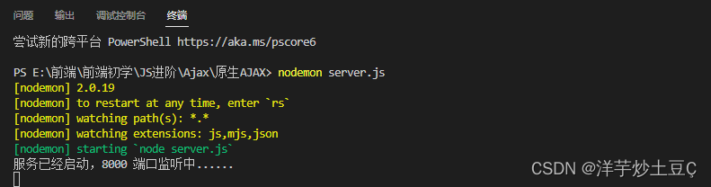
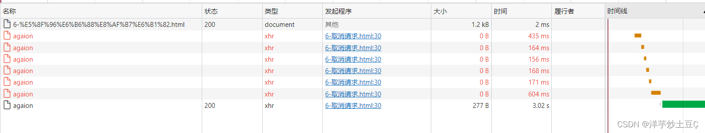

# AJAX 总结笔记

## 1，什么是 AJAX

AJAX = *A*synchronous *J*avaScript *A*nd *X*ML。AJAX 并非编程语言！

AJAX 仅仅组合了：

- 浏览器内建的 XMLHttpRequest 对象（从 web 服务器请求数据）
- JavaScript 和 HTML DOM（显示或使用数据）

Ajax 是一个令人误导的名称。Ajax 应用程序可能使用 XML 来传输数据，但将数据作为纯文本或 JSON 文本传输也同样常见。

> 通过 AJAX 可以在浏览器中向服务器发送异步请求，最大的优势：==无刷新获取数据==。AJAX 不是新的编程语言，而是一种将现有的标准组合在一起使用的新方式。

<!-- more -->

# 2，AJAX 优缺点

## 2.1，AJAX 的优点

1. 可以无需刷新页面而与服务器端进行通信。
2. 允许你根据用户事件来更新部分页面内容。

## 2.2， AJAX 的缺点

1. 没有浏览历史，不能回退
2. 存在跨域问题(同源)
3. SEO 不友好

# 3，AJAX 如何工作


![点击并拖拽以移动]编辑

1. 网页中发生一个事件（页面加载、按钮点击）
2. 由 JavaScript 创建 XMLHttpRequest 对象
3. XMLHttpRequest 对象向 web 服务器发送请求
4. 服务器处理该请求
5. 服务器将响应发送回网页
6. 由 JavaScript 读取响应
7. 由 JavaScript 执行正确的动作（比如更新页面）

# 4，原生 AJAX

## 4.1，XMLHttpRequest

有关 Ajax 的所有操作都是通过`XMLHttpRequest`来操作的。

## 4.2，服务端准备

在使用 Ajax 之前，因为需要对服务端发送请求，因此这里使用`express`框架，创建`server.js`文件搭建一个服务器。由于 Ajax 默认是服从同源策略，因此在服务器中设置`Access-Control-Allow-Origin`响应头在解决跨域问题（CORS 跨域）。（详见代码解析）

```javascript
//1.引入express
const { request, response } = require("express");
const express = require("express");

//2.创建应用对象
const app = express();

//3.创建路由规则(GET和POST分别创建)
//request是对请求报文的封装
//response是对相应报文的封装
//GET请求
app.get("/server", (request, response) => {
  //设置相应头
  response.setHeader("Access-Control-Allow-Origin", "*");
  //设置相应体
  response.send("HELLO AJAX agaion");
});

//POST请求
app.post("/server", (request, response) => {
  //设置相应头
  response.setHeader("Access-Control-Allow-Origin", "*");
  //设置相应体
  response.send("HELLO AJAX POST");
});
//4.监听端口启动服务端
app.listen(8000, () => {
  console.log("服务已经启动，8000 端口监听中......");
});
```

点击并拖拽以移动

在测试过程中，要保证服务端处于开启状态，开启命令：`node server.js`



## 4.3，发送 AJAX 请求

### 4.3.1，发送 get 请求

准备一个`html`文档，点击按钮向接口`http://127.0.0.1:8000`发送请求，请求的数据显示在 console（控制台）中。

```javascript
<button>点击发送请求</button>
    <div id="result"></div>
    <script>
        //获取button元素
        const btn = document.querySelector("button");
        var result = document.getElementById("result");
        //绑定事件
        btn.onclick = function () {
            //1.创建对象
            const xhr = new XMLHttpRequest();
            //2.初始化 设置请求方法和url
            xhr.open('GET', 'http://127.0.0.1:8000/server?a=100&b=200&c=300');
            //3.发送请求
            xhr.send();

            //4.事件绑定 处理服务端返回的结果
            //on:when当什么时候
            //readystage:是xml对象中的属性，表示状态0（未初始化即只创建完对象），1（open方法调用完毕），
            //           2（send方法调用完毕），3（服务端返回部分结果），4(服务端返回所有结果)
            //change:发生了改变
            xhr.onreadystatechange = function () {
                //判断服务端返回了所有的结果
                if (xhr.readyState === 4) {
                    //判断相应状态码 200 404 403 401 500
                    //2xx 成功
                    if (xhr.status >= 200 && xhr.status < 300) {
                        //处理结果 行 头 空行 体
                        /*
                        //1.相应行
                        console.log(xhr.status);//状态码
                        console.log(xhr.statusText);//状态字符串
                        //2.所有响应头
                        console.log(xhr.getAllResponseHeaders());
                        //3.所有相应体
                        console.log(xhr.response);
                        */
                        result.innerHTML = xhr.response;
                    }
                }
            }


    </script>
```

点击并拖拽以移动

### 4.3.2，发送 post 请求

将原来代码中`xhr.open()`第一个参数右`GET`改为`POST`

```javascript
<div class="result"></div>
    <script>
        const result = document.querySelector("div");
        result.addEventListener("mouseover",function(){
            //1.创建对象
            var xhr = new XMLHttpRequest;
            //2.初始化对象 设置类型方法和url
            xhr.open('POST','http://127.0.0.1:8000/server');
            xhr.setRequestHeader('name','agaion');//设置请求头
            xhr.setRequestHeader('Content-Type','application/x-www-form-urlencoded');//设置请求头

            //3.发送
            xhr.send('a=100&b=200&c=300');//请求体内容
            //4.事件绑定
            xhr.onreadystatechange = function(){
                if(xhr.readyState === 4){
                    if(xhr.status>=200&&xhr.status<300){
                        result.innerHTML = xhr.response;
                        console.log(xhr.status);
                        console.log(xhr.statusText);
                        console.log(xhr.getAllResponseHeaders());
                        console.log(xhr.response);
                    }
                }
            }
        })
    </script>
```

点击并拖拽以移动

**XMLHttpRequest 对象方法**

| 方法                                          | 描述                                                                                                                         |
| --------------------------------------------- | ---------------------------------------------------------------------------------------------------------------------------- |
| new XMLHttpRequest()                          | 创建新的 XMLHttpRequest 对象                                                                                                 |
| abort()                                       | 取消当前请求                                                                                                                 |
| getAllResponseHeaders()                       | 返回头部信息                                                                                                                 |
| getResponseHeader()                           | 返回特定的头部信息                                                                                                           |
| open(_method_, _url_, _async_, _user_, _psw_) | 规定请求 method：请求类型 GET 或 POST url：文件位置 async：true（异步）或 false（同步） user：可选的用户名称 psw：可选的密码 |
| send()                                        | 将请求发送到服务器，用于 GET 请求                                                                                            |
| send(_string_)                                | 将请求发送到服务器，用于 POST 请求                                                                                           |
| setRequestHeader()                            | 向要发送的报头添加标签/值对                                                                                                  |

**XMLHttpRequest 对象属性**

| 属性               | 描述                                                                                                                                                            |
| ------------------ | --------------------------------------------------------------------------------------------------------------------------------------------------------------- |
| onreadystatechange | 定义当 readyState 属性发生变化时被调用的函数                                                                                                                    |
| readyState         | 保存 XMLHttpRequest 的状态。 0：请求未初始化 1：服务器连接已建立 2：请求已收到 3：正在处理请求 4：请求已完成且响应已就绪                                        |
| responseText       | 以字符串返回响应数据                                                                                                                                            |
| responseXML        | 以 XML 数据返回响应数据                                                                                                                                         |
| status             | 返回请求的状态号 200: "OK" 403: "Forbidden" 404: "Not Found" 如需完整列表请访问 [Http 消息参考手册](https://www.w3school.com.cn/tags/html_ref_httpmessages.asp) |
| statusText         | 返回状态文本（比如 "OK" 或 "Not Found"）                                                                                                                        |

### 4.4.3，设置请求头信息

```javascript
// Content-Type  请求体类型
// application/x-www-form-urlencoded 查询字符串类型
xhr.setRequestHeader("Content-Type", "application/x-www-form-urlencoded");
复制代码;
```

点击并拖拽以移动

自定义请求头

```javascript
xhr.setRequestHeader("Name", "Alice");
复制代码;
```

点击并拖拽以移动

此时服务端需要设置`Access-Control-Allow-Headers`字段，表示可以接收处理的请求头，否则会报错：

```javascript
app.post("/index", (request, response) => {
  response.setHeader("Access-Control-Allow-Origin", "*");
  response.setHeader("Access-Control-Allow-Headers", "*");
  response.send("post ajax");
});
复制代码;
```

点击并拖拽以移动

一般可以在请求头中存放服务端要校验的信息。

# 5，AJAX 响应时问题

### 5.1，服务端响应 json 数据时

服务端若需要将 json 对象的数据返回给客户端，需要将其转为 JSON 字符串再发送，`server.js`添加代码如下：

```javascript
// all()表示可以匹配所有请求的方法
app.all("/json-data", (request, response) => {
  response.setHeader("Access-Control-Allow-Origin", "*");
  response.setHeader("Access-Control-Allow-Headers", "*");
  // 响应json数据，需要将json对象转为字符串格式
  const data = {
    name: "洋芋炒土豆",
    age: 20,
  };
  response.send(JSON.stringify(data));
});
```

点击并拖拽以移动

客户端处理结果时，需要将 json 字符串转为 json 对象：

（手动）

```javascript
button.addEventListener("click", function () {
  let xhr = new XMLHttpRequest();
  xhr.open("GET", "http://127.0.0.1:8282/json-data");
  xhr.send();
  xhr.onreadystatechange = function () {
    if (xhr.readyState === 4) {
      if (xhr.status >= 200 && xhr.status < 300) {
        // 将服务端返回的json数据转为json对象
        let data = JSON.parse(xhr.response);
        console.log(data);
      }
    }
  };
});
```

拖拽以移动

（自动）可以直接在`xhr`对象上设置响应体类型为`json`，就不用执行转换步骤：

```javascript
button.addEventListener("click", function () {
  let xhr = new XMLHttpRequest();
  xhr.responseType = "json";
  xhr.open("GET", "http://127.0.0.1:8282/json-data");
  xhr.send();
  xhr.onreadystatechange = function () {
    if (xhr.readyState === 4) {
      if (xhr.status >= 200 && xhr.status < 300) {
        let data = xhr.response;
        console.log(data);
      }
    }
  };
});
```

### 5.2，请求超时和网络异常处理

可以在`xhr`对象上设置超时时间，若在这个时间之内没有获取到响应结果，则会自动取消。例如，在服务端设置 3 秒后返回结果：

```javascript
// 延迟响应
app.get("/delay", (request, response) => {
  response.setHeader("Access-Control-Allow-Origin", "*");
  setTimeout(() => {
    response.send("延迟响应");
  }, 3000);
});
```

客户端设置超时时间为 2s：

```javascript
<button></button>
    <div class="result"></div>
    <script>
        var button = document.querySelector("button");
        var result = document.querySelector(".result");
        button.addEventListener("click",function(){
            var xhr = new XMLHttpRequest;
            xhr.timeout = 2000;
            xhr.ontimeout = function (){
                alert("网络超时，请稍后重试！");
            }
            xhr.onerror = function(){
                alert("您的网络似乎出现了一些问题！");
            }
            xhr.open("GET","http://127.0.0.1:8000/agaion");
            xhr.send();
            xhr.onreadystatechange = function(){
                if(xhr.readyState===4){
                    if(xhr.status>=200&&xhr.status<300){
                        result.innerHTML=xhr.response;
                    }
                }
            }
        })
    </script>
```

### 5.3，取消发送

`xhr`对象上的`abort()`可以用于取消请求：

```javascript
<script>
        var btn01 = document.querySelector(".btn01");
        var btn02 = document.querySelector(".btn02");
        let xhr = null;
        let isSending = false;
        btn01.addEventListener("click",function(){
            if(isSending) xhr.abort();
             xhr = new XMLHttpRequest();
             isSending = true;
             xhr.open("GET",".../agaion");
             xhr.send();
             xhr.onreadystatechange() = function(){
                if(xhr.reday===4){
                    isSending = false;
                }
             }
        })
        btn02.onclick = function(){
            xhr.abort();//取消发送
        }
    </script>
```

点击并拖拽以移动

### 5.4，重复发送请求

当我们多次点击按钮发送请求时，会对服务器造成一定压力，且多次请求的操作并不是必要的，解决这个重复请求问题，需要当再次发送请求时，把上一次没完成的请求取消掉。



代码：

```javascript
<button class="btn01">点击发送</button>
    <button class="btn02">点击取消</button>
    <script>
        var btn01 = document.querySelector(".btn01");
        var btn02 = document.querySelector(".btn02");
        let xhr = null;
        btn01.addEventListener("click",function(){
             xhr = new XMLHttpRequest();
             xhr.open("GET","http://127.0.0.1:8000/agaion");
             xhr.send();
        })
        btn02.onclick = function(){
            xhr.abort();
        }
    </script>
```

点击并拖拽以移动

# 6，用不同方法发送 AJAX 请求（非原生）

## 6.1，jQuery 发送 AJAX 请求

### 6.1.1，准备

我们可以使用 JavaScript 的对象 XMLHttpRequest 来实现原生 Ajax，但这种方法比较复杂，不易编写。jQuery 已经封装了 Ajax，使得发起 Ajax 请求比较容易，这里我们首先需要在 head 标记中引入 jQuery.js 文件。例如：

```javascript
<script src="https://cdn.bootcdn.net/ajax/libs/jquery/3.6.0/jquery.min.js"></script>
```

点击并拖拽以移动

### 6.1.2， **$.ajax()**

形式：$.ajax({name:val, name:val,...});
可选字段：

1. url：链接地址，字符串表示
2. data：需发送到服务器的数据，GET 与 POST 都可以，格式为{A: '...', B: '...'}
3. type："POST" 或 "GET"，请求类型
4. timeout：请求超时时间，单位为毫秒，数值表示
5. cache：是否缓存请求结果，bool 表示
6. contentType：内容类型，默认为"application/x-www-form-urlencoded"
7. dataType：服务器响应的数据类型，字符串表示；当填写为 json 时，回调函数中无需再对数据反序列化为 json
8. success：请求成功后，服务器回调的函数 error：请求失败后，服务器回调的函数
9. complete：请求完成后调用的函数，无论请求是成功还是失败，都会调用该函数；如果设置了 success 与 error 函数，则该函数在它们之后被调用
10. async：是否异步处理，bool 表示，默认为 true；设置该值为 false 后，JS 不会向下执行，而是原地等待服务器返回数据，并完成相应的回调函数后，再向下执行
11. username：访问认证请求中携带的用户名，字符串表示
12. password：返回认证请求中携带的密码，字符串表示

### 6.1.3， $.post()

形式：$.post(url, data, func, dataType);
可选参数：

1. url：链接地址，字符串表示
2. data：需要发送到服务器的数据，格式为{A: '...', B: '...'}
3. func：请求成功后，服务器回调的函数；function(data, status, xhr)，其中 data 为服务器回传的数据，status 为响应状态，xhr 为 XMLHttpRequest 对象，个人感觉关注 data 参数即可
4. dataType：服务器返回数据的格式

### 6.1.4， $.get()

形式：_$.get(url, data, func, dataType);_
其各个参数所示意义与$.post()一致，在此不再列出，区别是请求类型是 GET。

```javascript
<script>
        $("button").eq(0).click(function () {
            $.get("http://127.0.0.1:8000/agaion-jQuery", { a: 100, b: 200, c: 300 }, function (d) {
                console.log(d);
            })
        })
        $("button").eq(1).click(function () {
            $.post("http://127.0.0.1:8000/agaion-jQuery", { a: 100, b: 200, c: 300 }, function (d) {
                console.log(d);
            })
        })
        $("button").eq(2).click(function () {
            $.ajax({
                //url
                url: "http://127.0.0.1:8000/server",
                //响应体参数
                data: {a:100,b:200,c:300},
                //响应体类型
                type: 'GET',
                //响应体结果
                dataType: 'json',
                //成功的回调
                success: function(data){
                    console.log(data);
                },
                //超时的时间
                timeout: 4000,
                //失败的回调
                error: function(){
                    console.log("出错啦!");
                },
                headers: {
                    a: 100,
                    b: 200
                }
            })

        })
```

点击并拖拽以移动

## 6.2，axios 发送请求

### 6.2.1，准备

Axios 是一个基于 Promise 的 HTTP 库，也是对原生 XHR 的封装，可以在浏览器和 node.js 中使用。在使用时需要映入封装的文件，我们可以通过 node.js 的 npm 下载，也可以通过网页跨域加载。这里我们运用网页跨域加载。

```javascript
<script src="https://cdn.bootcdn.net/ajax/libs/axios/1.0.0-alpha.1/axios.js"></script>
```

点击并拖拽以移动

### 6.2.2，方式 （最为简单，简洁）

```javascript
<script>
  var btn = document.querySelectorAll("button"); //配置baseURL
  axios.defaults.baseURL = 'http://127.0.0.1:8000'; btn[0].onclick = function (){" "}
  {
    //GET请求
    axios
      .get("/axios-server", {
        //url 参数
        params: {
          id: 04213077,
          vip: 666,
        },
        //请求头信息
        headers: {
          name: "agaion",
          age: 20,
        },
      })
      .then((value) => {
        console.log(value);
      })
  }
  btn[1].onclick = function () {
    //POST请求
    axios
      .post(
        "/axios-server?aaaa",
        {
          username: "agaion",
          position: "ch",
        },
        {
          //url参数
          params: {
            id: 0421307,
            vip: 9,
          },
          headers: {
            weight: 180,
            height: 180,
          },
        }
      )
      .then((value) => {
        console.log(value);
      })
  }
  btn[2].onclick = function()
  {axios({
    //请求方法
    method: "POST",
    //url
    url: "/axios-server",
    //url参数
    params: {
      vip: 10,
      level: 30,
    },
    //头信息
    headers: {
      a: 100,
      b: 200,
    },
    //请求体设置
    data: {
      username: "agaion",
      pasword: "asasas",
    },
  }).then((value) => {
    console.log(value.status);
    console.log(value.statusText);
    console.log(value.headers);
    console.log(value.data);
  })}
</script>
```

点击并拖拽以移动

## 6.3，fetch 发送请求

fetch 号称是 ajax 的替代品，fetch 是一种 HTTP 数据请求的方式，是 XMLHttpRequest 的一种替代方案。fetch 不是 ajax 的进一步封装，而是原生 js，没有使用 XMLHttpRequest 对象。

Fetch API 主要有两个特点：一是接口合理化，AJAX 是将所有不同性质的接口都放在 XHR 对象上，而 Fetch 是将它们分散在几个不同的对象上，设计更合理；二是 Fetch 操作返回 Promise 对象，避免了嵌套的回调函数。

由于 fetch 本身就是 js 的自带属性，所以不需要引入其他封装包。

```javascript
<script>
  var btn = document.querySelector("button"); btn.onclick = function()
  {fetch("http://127.0.0.1:8000/fetch-server?id=04213077&name=728", {
    method: "POST",
    headers: {
      name: "zhangwei",
      age: 19,
    },
    body: "username=admin&pasename=admin",
  })
    .then((response) => {
      return response.text();
    })
    .then((response) => {
      console.log(response);
    })}
</script>
```

# 7，同源策略和解决跨域问题

## 7.1，同源策略

### 7.1.1，什么是同源策略

- 同源策略是一种约定，它是浏览器最核心也最基本的安全功能，如果缺少了同源策略，**浏览器很容易受到 XSS、CSRF 等攻击。**

- 所谓同源是指"

  协议+域名+端口

  "三者相同，即便两个不同的域名指向同一个 ip 地址，也非同源。

  - 形式：`协议：//域名:(端口号)`


### 7.1.2，同源策略的限制内容

同源策略限制以下几种行为：

- Cookie、LocalStorage 和 IndexDB 无法读取
- DOM 和 JS 对象无法获得
- AJAX 请求不能发送，被浏览器拦截了 但是有三个标签是允许跨域加载资源：
- ``
- `<link href=XXX>`
- `<script src=XXX>`

## 7.2，跨域

### 7.2.1，跨域的原理

- **跨域**，是指浏览器**不能执行**其他网站的脚本。它是由浏览器的`同源策略`造成的。
- **跨域原理**，即是通过各种方式，`避开浏览器的安全限制`。

### 7.2.2， JSONP 跨域

**（1）原理：**

- `JSONP`通过同源策略涉及不到的"漏洞"，也就是像`img`中的`src`，`link`标签的`href`，`script`的`src`都**不受同源策略的限制**。
- 利用这个特性，服务端**不再返回 JSON 格式**的数据，而是 **返回一段调用某个函数的 js 代码**，在 src 中进行了调用，这样实现了跨域。

**（2）步骤：**

1. 创建一个 script 标签
2. script 的 src 属性设置接口地址
3. 接口参数，必须要带一个自定义函数名（前后端约定好），要不然后台无法返回数据
4. 通过自定义函数名去接受返回的数据

```javascript
// 动态创建 script
var script = document.createElement("script");
script.setAttribute("type", "text/javascript");
// 设置回调函数，用于后端返回的js代码中进行调用
function getData(data) {
  console.log(data);
}
//设置 script 的 src 属性，并设置请求地址
script.src = "http://localhost:3000/?callback=getData";
// 让 script 生效
document.body.appendChild(script); //将返回的文本插入页面执行，让script调用回调函数
```

点击并拖拽以移动

**（3）JSONP 的缺点**:

JSON 只支持 get，因为 script 标签只能使用 get 请求； JSONP 需要后端配合返回指定格式的数据。

### 7.2.3，CORS 跨域

添加请求头实现跨域。

```javascript
response.setHeader("Access-Control-Allow-Headers", "*");
```

点击并拖拽以移动
