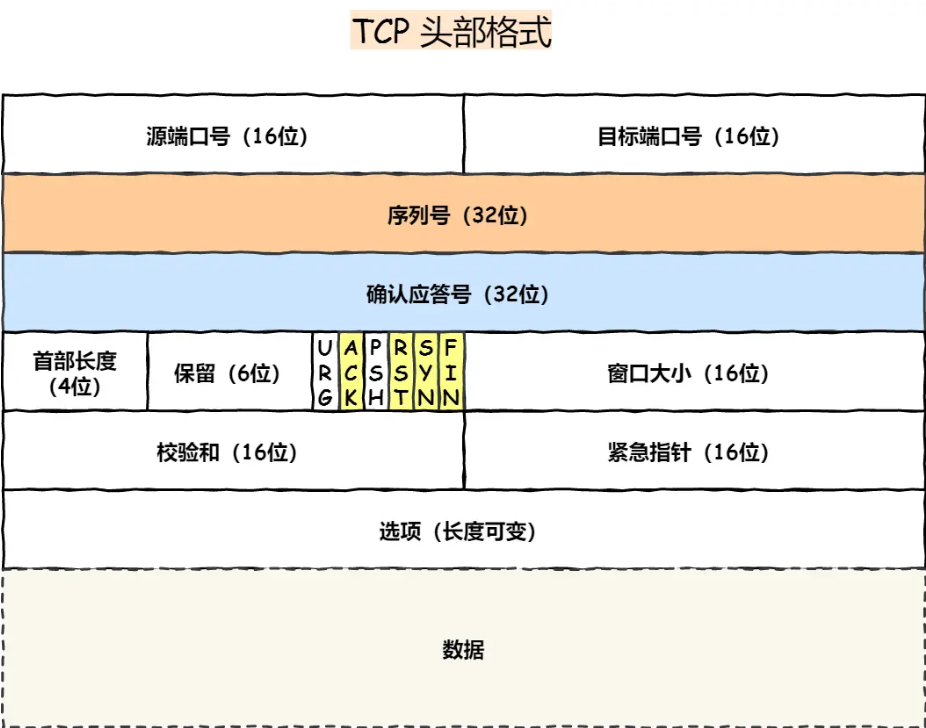

# TCP报文

## 什么是TCP

TCP 是**面向连接的、可靠的、基于字节流**的传输层通信协议。而**UDP是一个面向无连接的传输层协议。**(就这么简单，其它TCP的特性也就没有了。

具体来分析，和 `UDP` 相比，`TCP` 有三大核心特性:

1. **面向连接**。所谓的连接，指的是客户端和服务器的连接，在双方互相通信之前，TCP 需要三次握手建立连接，而 UDP 没有相应建立连接的过程。
2. **可靠性**。TCP 花了非常多的功夫保证连接的可靠，这个可靠性体现在哪些方面呢？一个是有状态，另一个是可控制。

TCP 会精准记录哪些数据发送了，哪些数据被对方接收了，哪些没有被接收到，而且保证数据包按序到达，不允许半点差错。这是**有状态**。

当意识到丢包了或者网络环境不佳，TCP 会根据具体情况调整自己的行为，控制自己的发送速度或者重发。这是**可控制**。

相应的，UDP 就是`无状态`, `不可控`的。

​	3.  **面向字节流**。UDP 的数据传输是基于数据报的，这是因为仅仅只是继承了 IP 层的特性，而 TCP 为了维护状态，将一个个 IP 包变成了字节流。

## TCP的头部格式

**序列号**：在建立连接时由计算机生成的随机数作为其初始值，通过 SYN 包传给接收端主机，每发送一次数据，就「累加」一次该「数据字节数」的大小。**用来解决网络包乱序问题。**

**确认应答号**：指下一次「期望」收到的数据的序列号，发送端收到这个确认应答以后可以认为在这个序号以前的数据都已经被正常接收。**用来解决丢包的问题。**

**控制位：**

- *ACK*：该位为 `1` 时，「确认应答」的字段变为有效，TCP 规定除了最初建立连接时的 `SYN` 包之外该位必须设置为 `1` 。
- *RST*：该位为 `1` 时，表示 TCP 连接中出现异常必须强制断开连接。
- *SYN*：该位为 `1` 时，表示希望建立连接，并在其「序列号」的字段进行序列号初始值的设定。
- *FIN*：该位为 `1` 时，表示今后不会再有数据发送，希望断开连接。当通信结束希望断开连接时，通信双方的主机之间就可以相互交换 `FIN` 位为 1 的 TCP 段。