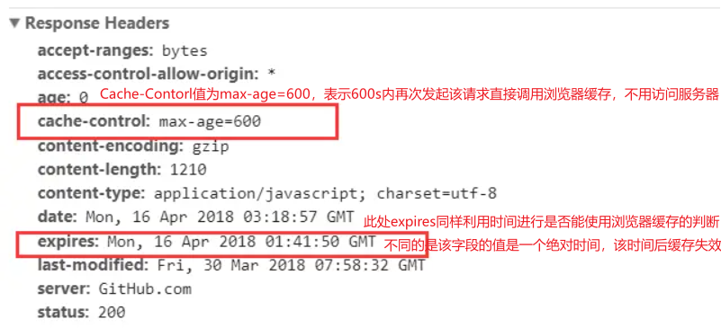
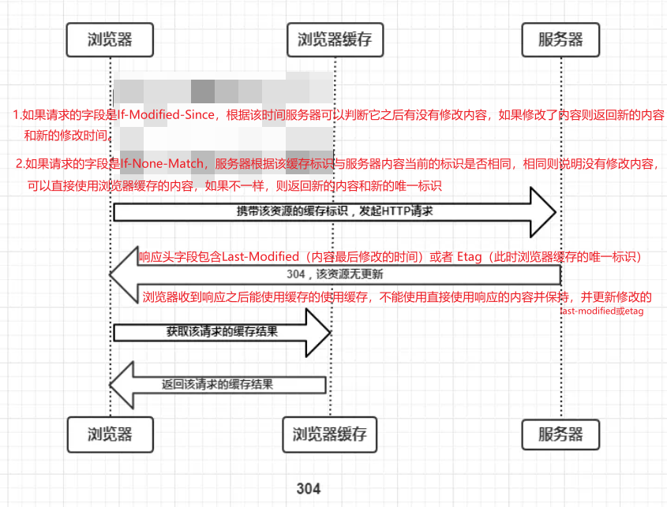

# HTTP缓存机制 | 浏览器缓存

## HTTP强缓存和协商缓存的概念

在浏览器缓存中，可以通过两种方式来控制缓存的行为：强缓存和协商缓存。

<!-- more -->

### **强缓存**（Cache-Control 和 Expires）

强制缓存就是向**浏览器缓存**查找该请求结果，并根据该结果的缓存规则来决定是否使用该缓存结果的过程，强制缓存的情况主要有三种，如下：

- 不存在该缓存结果和缓存标识，强制缓存失效，则直接向服务器发起请求，服务器返回的响应体中包含请求的内容和强制缓存的标识（强制缓存中标识通常表示过期的时间），然后将请求的内容存入浏览器缓存中。
- 存在该缓存结果和缓存标识，但该结果已失效（强制缓存中通常表示缓存内容超时），强制缓存失效，这时需要判断是否使用协商缓存，如果不使用，重新向服务器发起请求。
- 存在该缓存结果和缓存标识，且该结果尚未失效，强制缓存生效，直接返回该结果（直接使用缓存中的数据不再向服务器发起请求）。

`Expires`是HTTP/1.0控制网页缓存的字段，其值为服务器返回该请求结果缓存的到期时间，即再次发起该请求时，如果客户端的时间小于Expires的值时，直接使用缓存结果。

`Cache-Control`是HTTP/1.1中重要的规则字段，主要用于控制网页缓存，主要取值为：

| Cache-Control的值 | 意义                                                       |
| ----------------- | ---------------------------------------------------------- |
| public            | 所有内容都将被缓存（客户端和服务器都可以缓存）             |
| private           | 所有内容只有客户端可以缓存，Cache-Control的默认取值        |
| no-cache          | 客户端缓存内容，但是是否使用缓存需要通过协商缓存来验证决定 |
| no-store          | 所有内容都不会被缓存，既不能使用强制缓存，也不能使用协商   |
| max-age = xxx     | 缓存内容将在xxx秒（相对时间）后失效                        |

::: tip

到了HTTP/1.1，Expire已经被Cache-Control替代，原因在于Expires控制缓存的原理是使用客户端的时间与服务端返回的时间做对比，那么如果客户端与服务端的时间因为某些原因（例如时区不同；客户端和服务端有一方的时间不准确）发生误差，那么强制缓存则会直接失效，这样的话强制缓存的存在则毫无意义

:::

例如：

由于Cache-Control的优先级比expires，那么直接根据Cache-Control的值进行缓存，意思就是说在600秒内再次发起该请求，则会直接使用缓存结果，强制缓存生效。

注：在无法确定客户端的时间是否与服务端的时间同步的情况下，Cache-Control相比于expires是更好的选择，所以同时存在时，只有Cache-Control生效。

### 协商缓存 （Last-Modified 和 ETag）

协商缓存就是当强制缓存失效后，浏览器携带缓存标识向服务器发起请求，由服务器根据缓存标识决定是否使用浏览器缓存，主要过程有以下两种情况：

- 缓存协议生效，返回304，于是浏览器读取浏览器缓存中保存的数据。
- 协商缓存失效，返回200和请求结果结果，并再次更新缓存标识

协商缓存流程：

- `If-Modified-Since`是客户端再次发起该请求时，携带上次请求返回的Last-Modified值，通过此字段值告诉服务器该资源上次请求返回的最后被修改时间。
- 服务器收到该请求，发现请求头含有If-Modified-Since字段，则会根据If-Modified-Since的字段值与该资源在服务器的最后被修改时间做对比.
- 若服务器的资源最后被修改时间大于If-Modified-Since的字段值，则重新返回资源，状态码为200；否则则返回304，代表资源无更新，可继续使用缓存文件。

- `If-None-Match`是客户端再次发起该请求时，携带上次请求返回的唯一标识Etag值，通过此字段值告诉服务器该资源上次请求返回的唯一标识值。
- 服务器收到该请求后，发现该请求头中含有If-None-Match，则会根据If-None-Match的字段值与该资源在服务器的Etag值做对比。
- 对比结果一致则返回304，代表资源无更新，继续使用缓存文件；不一致则重新返回资源文件，状态码为200

注：`Etag` / `If-None-Match`优先级高于`Last-Modified` / `If-Modified-Since`，同时存在则只有`Etag` / `If-None-Match`生效。

