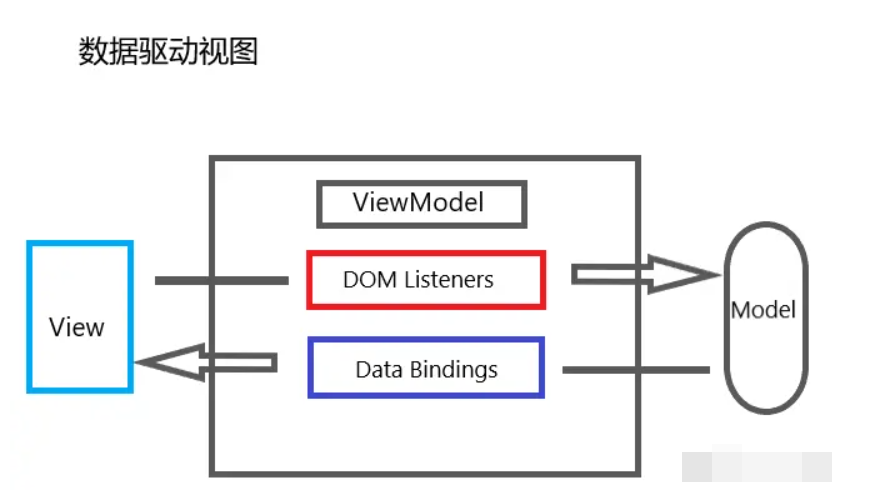
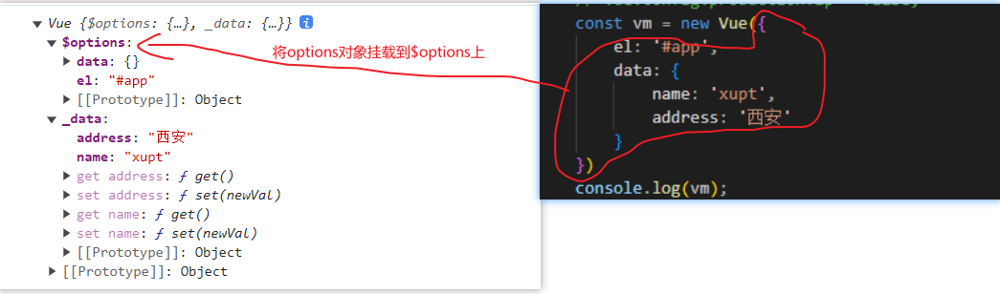
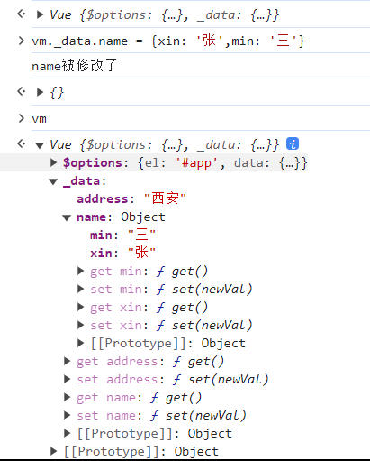

# MVVM实现原理

## 什么是MVVM

```java
模式说明: MVVM = Model + View + ViewModel
```

- M：model模型层，负责处理业务逻辑以及和服务器端进行交互 (data里定义)
- V：view视图层：负责将数据模型转化为UI展示出来，可以简单的理解为HTML页面（template里定义html页面结构)
- VM：视图模型层，用来连接Model和View，是Model和View之间的通信桥梁(vue组件实例this)

<!-- more -->



在MVVM架构中，是不允许数据和视图直接通信的，只能通过ViewModel来通信，而ViewModel就是定义了一个Observer观察者。ViewModel是连接View和Model的中间件。

- ViewModel能够观察到数据（Model）的变化，并对视图（View）对应的内容进行更新。
- ViewModel能够监听到视图（View）的变化，并能够通知数据（Model）发生变化。

到此，我们就明白了，Vue.js就是一个MVVM的实现者，它的核心就是实现了DOM监听与数据绑定。

MVVM源自于经典的MVC（Model-View-Controller）模式。MVVM的核心是ViewModel层，负责转换Model中的数据对象来让数据变得更容易管理和使用，其作用如下：

- 该层向上与视图层进行双向数据绑定。
- 向下与Model层通过接口请求进行数据交互。

::: tip

总结：MVVM就是双向数据绑定，它的特点是数据影响视图，试图影响数据。

:::

## MVVM的实现

实现的核心原理：MVVM的双向数据绑定 = 数据劫持 + 观察者模式

### 数据劫持

为什么要做数据劫持？

- 观察对象，给对象增加Object.defineProperty
- vue特点是不能新增不存在的属性 不存在的属性没有get和set
- 深度响应 因为每次赋予一个新对象时会给这个新对象增加defineProperty(数据劫持)

```js
// 创建一个Vue(MVVM)构造函数
// 这里用es6方法将options赋一个初始值，防止没传，等同于options || {}
function Vue(options = {}) {   
    // vm.$options Vue上是将所有属性挂载到上面
    // 所以我们也同样实现,将所有属性挂载到了$options
    this.$options = options;
    // this._data 这里也和Vue一样
    let data = this._data = this.$options.data;
    
    // 数据劫持
    observe(data);
}
// 观察对象，给对象增加Object.defineProperty

// 创建一个Observe构造函数
// 写数据劫持的主要逻辑
function Observe(data) {
    // 遍历data对象
    Object.keys(data).forEach(key => {
        let val = data[key];
        observe(val);// 递归继续向下找，实现深度的数据劫持

        // 给data的每一个属性添加getter和setter
        Object.defineProperty(data, key, {
            // 允许删除对象内的属性
            configurable: true,
            get() { 
                return val;
            },
            set(newVal) { 
                if (newVal === val) {
                    return;
                }
                val = newVal;// 如果以后在获取(get)的时候，将刚才设置的值再返回回去
                observe(newVal);// 当设置为新值之后，也需要把新值再去定义成属性
                console.log(key + '被修改了');
            }
        })
    });
}
function observe(data) {
    // 递归结束的条件
    if (!data || typeof data !== 'object') {
        return;
    }
    return new Observe(data);
}
```



### 数据代理

为什么要数据代理：



这里如果要读取到一个vm实例中的数据需要寻找多次才能找到。

```js
function Vue(options = {}) {
    this.$options = options;
    let data = this._data = this.$options.data;
    // 数据劫持
    observe(data);

    // 数据代理，将this._data的内容暴露到this,即this代理this._data
    // this.name = '张三'
    // 利用defineProperty给this（在实际应用中就是一个Vue实例）添加属性，属性都是来自data(this._data)的属性
    Object.keys(data).forEach(key => {
        Object.defineProperty(this, key, {
            get() {
                return this._data[key];
            },
            set(newVal) {
                this._data[key] = newVal;
            }
        })
    })
}
```

### 数据编译

写到这里数据劫持和数据代理都实现了，那么接下来就需要编译了，我们需要把{{}}里面的内容解析出来。我们要将vm对象中的对应data数据放到{{}}中的对应属性上，即需要重新处理dom树

```js
// 数据编译
// 创建Compile构造函数
function Compile(el, vm) {
    // 将el挂载到实例上方便调用
    vm.$el = document.querySelector(el);
    // 在el范围里将内容都拿到，当然不能一个一个的拿
    // 可以选择移到内存中去然后放入文档碎片中，节省开销
    let fragment = document.createDocumentFragment();
    while (child = vm.$el.firstChild) {
        fragment.appendChild(child);// 此时将el中的内容放入内存中
    }
    // 对文档内容碎片进行重新编译处理
    function replace(frag) {
        Array.from(frag.childNodes).forEach(node => {
            let txt = node.textContent;
            // console.log(txt);
            let reg = /\{\{(.*)\}\}/; // 正则匹配{{}},找到需要渲染数据的地方
            if (node.nodeType === 3 && reg.test(txt)) {
                // 如果既是文本节点又是大括号的情况
                let arr = RegExp.$1.split('.');
                let val = vm;
                arr.forEach(key => {
                    val = val[key];//这里的循环是解决深度问题，如{{}}中的属性是a.b.c，这里就需要取到b对象的c属性上
                })
                node.textContent = txt.replace(reg, val);
            }
            if (node.childNodes) {
                replace(node);
            }
        })
    }
    replace(fragment);
    vm.$el.appendChild(fragment);
}
```

### 观察者模式实现数据更新视图

实现这个功能模块的意义在于数据改变时视图也会发生改变，使用观察者模式来解释：

- 我们首先明确观察者模式的两个对象：Watcher观察者对象和Subject主题对象
- 我们需要先确定哪些数据需要被观察，即哪些被渲染到页面上的数据需要被观察，所有当页面数据渲染完成后立马对他通过闭包创建一个Watcher观察者对象，对象中包含当内容数据变化时，Watcher观察者对象接收变化后的数据并在页面上数据重新渲染的方法
- 在开始渲染数据前定义一个Subject主题对象，在每次渲染读取数据时（即调用get方法时）对每一个数据添加一个观察者对象
- 当内容数据发生变化时，通过调用Subject主题对象的notify方法通知主题对象内收集的观察者对象身上的修改页面数据的方法，这样当一个内容数据发生变化时，页面上所有依赖于他的数据全部重新渲染一遍，这样就实现了数据视图更新。

::: tip

总结：

- 观察者设计模式关联了Compile()数据渲染和Observe()数据劫持。
- 在数据渲染中，我们确定了要观察的数据对象和重新渲染的逻辑。
- 在数据劫持中，我们收集了要观察的对象，并在内容数据发送变化时调用观察对象中的重新渲染方法，这样就实现了数据的同步渲染。

:::

#### 观察者对象和主题对象的定义

```js
function Subject() {
    this.subs = [];
}
Subject.prototype = {
    addSub(sub) {
        this.subs.push(sub);
    },
    notify() { 
        this.subs.forEach(sub => sub.update());
    }
}
function Watcher(vm,exp,fn) {
    this.fn = fn;
    this.vm = vm;
    this.exp = exp;
    //给Subject添加一个属性
    Subject.target = this;
    let arr = exp.split('.');
    let val = vm;
    arr.forEach(key => {
        val = val[key];
    })
    Subject.target = null;
}
Watcher.prototype.update = function () { 
    // notity的时候值已经修改过了
    // 再通过vm,exp来获取新的值
    let arr = this.exp.split('.');
    let val = this.vm;
    arr.forEach(key => {
        val = val[key];// 通过get获取新的值
    })
    this.fn(val);
}
```

#### 在数据渲染中通过闭包绑定观察者

```js
// 数据编译
// 创建Compile构造函数
function Compile(el, vm) {
    // 将el挂载到实例上方便调用
    vm.$el = document.querySelector(el);
    // 在el范围里将内容都拿到，当然不能一个一个的拿
    // 可以选择移到内存中去然后放入文档碎片中，节省开销
    let fragment = document.createDocumentFragment();
    while (child = vm.$el.firstChild) {
        fragment.appendChild(child);// 此时将el中的内容放入内存中
    }
    // 对文档内容碎片进行重新编译处理
    function replace(frag) {
        Array.from(frag.childNodes).forEach(node => {
            let txt = node.textContent;
            let reg = /\{\{(.*)\}\}/; // 正则匹配{{}}
            if (node.nodeType === 3 && reg.test(txt)) {
                // 如果既是文本节点又是大括号的情况
                let arr = RegExp.$1.split('.');
                let val = vm;
                arr.forEach(key => {
                    val = val[key];//这里的循环是解决深度问题，如{{}}中的属性是a.b.c，这里就需要取到b对象的c属性上
                })
                node.textContent = txt.replace(reg, val);
                // 监听变化
                // 给Wacher再添加两个参数，用来取新的值(newVal)给回调函数传参
                new Watcher(vm, RegExp.$1, newVal => {
                    node.textContent = txt.replace(reg, newVal);
                })
            }
            if (node.childNodes) {
                replace(node);
            }
        })
    }
    replace(fragment);
    vm.$el.appendChild(fragment);
}
```

#### 在数据劫持中定义主题对象收集观察者，并在数据改变时通知收集到的观察者

```js {2,12,21}
function Observe(data) {
    let subject = new Subject();
    // 遍历data对象
    Object.keys(data).forEach(key => {
        let val = data[key];
        observe(val);// 递归继续向下找，实现深度的数据劫持
        // 给data的每一个属性添加getter和setter
        Object.defineProperty(data, key, {
            // 允许删除对象内的属性
            configurable: true,
            get() {
                Subject.target && subject.addSub(Subject.target);
                return val;
            },
            set(newVal) {
                if (newVal === val) {
                    return;
                }
                val = newVal;// 如果以后在获取(get)的时候，将刚才设置的值再返回回去
                observe(newVal);// 当设置为新值之后，也需要把新值再去定义成属性
                subject.notify();
            }
        })
    });
}
```

### 实现双向数据绑定

```js
function Compile(el, vm) {
    ......
    // 对文档内容碎片进行重新编译处理
    function replace(frag) {
        //遍历文档节点
        Array.from(frag.childNodes).forEach(node => {
            //处理文本节点内容......
            
            //处理元素节点内容
            if (node.nodeType === 1) {//元素节点
                let nodeAttr = node.attributes; // 获取dom上的所有属性,是个类数组
                Array.from(nodeAttr).forEach(attr => {
                    let name = attr.name;   // v-model  type
                    let exp = attr.value;   // c        text
                    if (name.includes('v-')){
                        node.value = vm[exp];   // this.c 为 2
                    }
                    // 监听变化
                    new Watcher(vm, exp, function(newVal) {
                        node.value = newVal;   // 当watcher触发时会自动将内容放进输入框中
                    });
                    
                    node.addEventListener('input', e => {
                        let newVal = e.target.value;
                        // 相当于给this.c赋了一个新值
                        // 而值的改变会调用set，set中又会调用notify，notify中调用watcher的update方法实现了更新
                        vm[exp] = newVal;   
                    });
                });
            }
            if (node.childNodes) {
                replace(node);
            }
        })
    }
    replace(fragment);
    vm.$el.appendChild(fragment);
}
```

