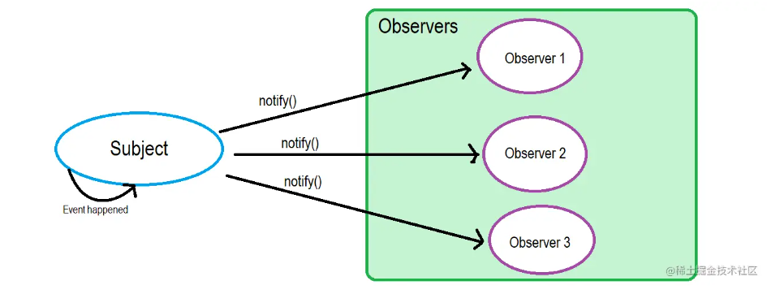

# 观察者模式

## 什么是观察者模式

定义了一种一对多的关系，让多个观察者对象同时监听某一个主题对象，这个主题对象的状态发生变化时就会通知所有的观察者对象，使它们能够自动更新自己，当一个对象的改变需要同时改变其它对象，并且它不知道具体有多少对象需要改变的时候，就应该考虑使用观察者模式。

::: tip

**观察者模式** 在软件设计中是一个对象，维护一个依赖列表，当任何状态发生改变自动通知它们。

:::

<!-- more -->

## 观察者模式原理

在观察者模式中，只有两种主体：目标对象 (`Subject`) 和 观察者 (`Observer`)。当这个目标对象的状态发生变化时，所有依赖于它的观察者对象都会得到通知并执行它们各自特有的行为。

目标对象 `Subject`:

目标类，它是一个抽象类，也是所有目标对象的父类。它用一个列表记录当前目标对象有哪些观察者对象，并提供增加、删除观察者对象和通知观察者对象的接口。

观察者类`Observer`：

观察者类，它也是一个抽象类，是所有观察者对象的父类；它为所有的观察者对象都定义了一个名为`update`的方法（也叫成员函数）。当目标对象的状态改变时，它就是通过调用它的所有观察者对象的`update`方法来通知它们的。




## 观察者模式的简单实现

```js
function Subject() {
    this.subs = [];
}
Subject.prototype.addSub = function (sub) { 
    this.subs.push(sub);
}
Subject.prototype.notify = function () { 
    this.subs.forEach(sub => { 
        sub.update();
    })
}
function Observer(fn) {
    this.fn = fn;
}
Observer.prototype.update = function () { 
    this.fn();
}
let watcher = new Observer(() => console.log('观察者'))
let dep = new Subject();
dep.addSub(watcher);//watcher观察者订阅dep实例
console.log(dep.notify());
```

