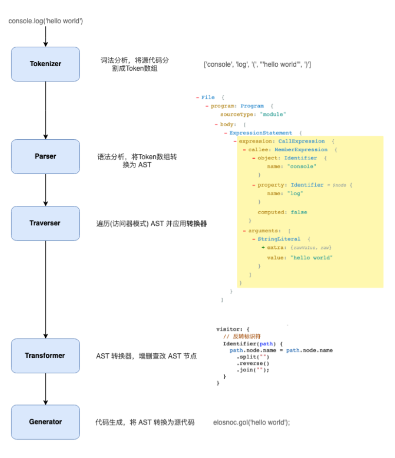

# Babel的工作原理

## 什么是Babel

官方文档说明：Babel是一个`Javascript`编译器。众所周知`JavaScript`是一门解释型或即时编译型语言，所以不能和其他语言一样做到先编译在运行，因此导致如果代码存在问题将不会被处理，因此Babel就提供了这种功能将JavaScript代码先编译处理一遍再交给浏览器进程处理。

Babel 是一个工具链，主要用于将采用 ECMAScript 2015+ 语法编写的代码转换为向后兼容的 JavaScript 语法，以便能够运行在当前和旧版本的浏览器或其他环境中。下面列出的是 Babel 能为你做的事情：

- 语法转换
- 通过 Polyfill 方式在目标环境中添加缺失的功能（通过引入第三方 polyfill 模块，例如 [core-js](https://github.com/zloirock/core-js)）
- 源码转换（codemods）

```js
// Babel 接收到的输入是： ES2015 箭头函数
[1, 2, 3].map(n => n + 1);

// Babel 输出： ES5 语法实现的同等功能
[1, 2, 3].map(function(n) {
  return n + 1;
});
```

## Babel的基本原理

原理很简单，核心就是 `AST (抽象语法树)`。首先将源码转成抽象语法树，然后对语法树进行处理生成新的语法树，最后将新语法树生成新的 JS 代码，整个编译过程可以分为 3 个阶段 `parsing` (解析)、`transforming` (转换)、`generating` (生成)，而它们都是围绕AST处理的。

### Babel的处理流程

Babel编译流程，如下图：



#### 解析

解析主要包括两个过程：词法解析和语法解析。

**词法解析**： `词法解析器(Tokenizer)`在这个阶段将字符串形式的代码转换为`Tokens(令牌)`. Tokens 可以视作是一些语法片段组成的数组。

词法分析阶段把字符串形式的代码解析成一个个具有实际意义的**语法单元**组成的数据（数组），这种数据被称之为**令牌**（tokens）流。

语法单元是解析语法当中具备实际意义的最小单元，常见的语法单元如：空白、注释、字符串、数字、标识符（没有被引号括起来的连续字符，可能包含字母、_、$、及数字(数字不能作为开头)。标识符可能作为一个变量，也可能是if、return、function、new这种关键字）、运算符、括号等等。

**语法解析**：这个阶段语法`解析器(Parser)`会把`Tokens`转换为`抽象语法树(Abstract Syntax Tree，AST)`

AST抽象语法树，它是源代码语法结构的一种抽象表示。它以树状的形式表示编程语言的语法结构。树上的每个节点都表示源代码中的一种结构。**AST 是 Babel 转译的核心数据结构，后续的操作都依赖于 AST**。

**转换**：通过`@babel/traverse`遍历抽象语法树(AST),并调用Babel配置文件中的插件,对抽象语法树(AST)进行增删改处理。Babel 所有插件都是在这个阶段工作, 比如语法转换、代码压缩。

**生成**：通过`@babel/generator`把转换后的抽象语法书(AST)生成目标代码

### Babel的架构

Babel为了适应复杂的定制需求和平凡的功能变化，使用了微内核的架构风格。它的核心非常小，大部分都是想通过插件扩展来实现的。


#### 核心

`@babel/core` 这也是上面说的‘微内核’架构中的‘内核’。对于Babel来说，这个内核主要干这些事情：

- 加载和处理配置(config)
- 加载插件
- 调用 `Parser` 进行语法解析，生成 `AST`
- 调用 `Traverser` 遍历AST，并使用`访问者模式`应用'插件'对 AST 进行转换
- 生成代码，包括SourceMap转换和源代码生成

#### 核心周边

- **Parser(** `@babel/parser` **)** ： 将源代码解析为 AST 。它已经内置支持很多语法. 例如 JSX、Typescript、Flow、以及最新的ECMAScript规范。目前为了执行效率，parser是不支持扩展的，由官方进行维护。
- **Traverser(** `@babel/traverse` **)** ： 对 AST 进行遍历，`转换插件`会通过它获取感兴趣的AST节点，对节点继续操作
- **Generator(** `@babel/generator` **)** ： 将 AST 转换为源代码

#### 插件

打开 Babel 的源代码，会发现有好几种类型的‘插件’。

**语法插件(`@babel/plugin-syntax-\*`)**：语法插件仅允许 babel 解析语法，不做转换操作；当添加语法插件后，使得babel能够解析更多的语法

**转换插件**： 当添加转译插件后，会将源代码进行转译输出。用于对 AST 进行转换, 实现转换为ES5代码、压缩、功能增强等目的. Babel仓库将转换插件划分为两种(只是命名上的区别)：

- `@babel/plugin-transform-*`： 普通的转换插件
- `@babel/plugin-proposal-*`： 还在'提议阶段'(非正式)的语言特性, 目前有这些

**预定义集合(`@babel/presets-\*`)**： 插件集合或者分组，主要方便用户对插件进行管理和使用。比如`preset-env`含括所有的标准的最新特性; 再比如`preset-react`含括所有react相关的插件.
