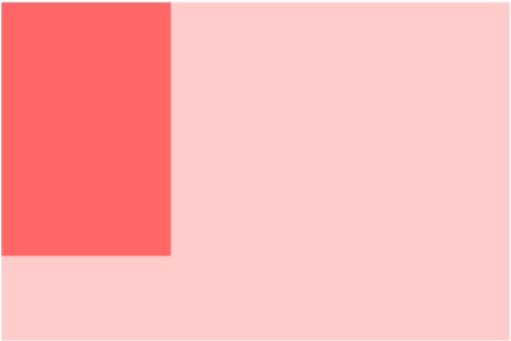

# CSS面试常考题

## 1.说说你对盒模型的理解

### 是什么

当对⼀个⽂档HTML进⾏布局的时候，浏览器的渲染引擎会根据标准之⼀的 CSS 基础框盒模型，将所有元素表示为⼀个个矩形的盒⼦。

一个盒子由四部分组成：`content`、`padding`、`border`、`margin`

这是因为，在 CSS 中，盒⼦模型可以分成：

- 标准盒模型（W3C）
- 怪异盒模型（IE）

默认情况下，盒⼦模型为 W3C 标准盒⼦模型

### 标准盒模型

- 盒⼦总宽度 = `width` + `padding` + `border` + `margin`
- 盒子总高度 = `height` + `padding` + `border` + `margin`

> 同时我们也可以看出，`height/width` 只是内容高度，不包含`padding`和`border`的值

### 怪异盒模型

- 盒子总宽度：width + margin
- 盒子总高度：height + margin

> 此时我们发现，`height/width` 包含了`padding`和`border`的值

### Box-sizing

CSS 中的 box-sizing 属性定义了引擎应该如何计算⼀个元素的总宽度和总⾼度

```css
box-sizing: content-box|border-box|inherit:
```

- content-box 默认值，元素的 width/height 不包含padding，border，与**标准盒⼦模型表现⼀致**
- border-box 元素的 width/height 包含 padding，border，与**怪异盒⼦模型表现⼀致**
- inherit 指定 box-sizing 属性的值，应该**从⽗元素继承**

## 2.谈谈你对BFC的理解

### 是什么

我们在⻚⾯布局的时候，经常出现以下情况：

- 这个元素⾼度怎么没了？
- 两栏布局怎么没法⾃适应
- 这两个元素的间距怎么有点奇怪的样⼦？

原因是元素之间相互的影响，导致了意料之外的情况，这⾥就涉及到 BFC 概念，BFC （Block Formatting Context）即块级格式化上下⽂，它是⻚⾯中的⼀块渲染区域，并且有⼀套属于⾃⼰的渲染规则：

- 内部的盒⼦会在垂直⽅向上⼀个接⼀个的放置
- 对于同⼀个BFC内的两个相邻的盒⼦的margin会发⽣重叠，与⽅向⽆关。（使用两个BFC解决margin重叠的问题）
- 每个元素的左外边距与包含块的左边界相接触（从左到右），即使浮动元素也是如此
- BFC的区域不会与float的元素区域重叠
- 计算BFC的⾼度时，浮动⼦元素也参与计算（解决高度塌陷问题，清除内部浮动）
- BFC就是⻚⾯上的⼀个隔离的独⽴容器，容器⾥⾯的⼦元素不会影响到外⾯的元素，反之亦然BFC ⽬的是形成⼀个相对于外界完全独⽴的空间，让内部的⼦元素不会影响到外部的元素

### 触发条件

- 根元素
- 浮动元素
- `overflow`的值不为`visible`
- `display`的值为：flex、grid、inline-block、table等
- `position`的值为`absolute`或`flex`

### BFC实现自适应的多栏布局

这⾥举个两栏的布局

```html
<style>
     body {
         width: 300px;
         position: relative;
     }
     .aside {
         width: 100px;
         height: 150px;
         float: left;
         background: #f66;
     }
     .main {
         height: 200px;
         background: #fcc;
     }
</style>
<body>
     <div class="aside"></div>
     <div class="main"></div>
</body>
```

效果图如下：



前⾯讲到，每个元素的左外边距与包含块的左边界相接触。因此，虽然 `.aslide` 为浮动元素，但是 `main` 的左边依然会与包含块的左边相接触，⽽ BFC 的区域不会与浮动盒⼦重叠，所以我们可以通过触发 main ⽣成 BFC ，以此适应两栏布局

```css
.main {
	overflown: hidden;
}
```

这时候，新的 BFC 不会与浮动的 .aside 元素重叠。因此会根据包含块的宽度，和 .aside 的宽度，⾃动变窄

## 3.响应式布局

### 什么是响应式布局

响应式⽹站设计（Responsive Web design）是⼀种⽹络⻚⾯设计布局，⻚⾯的设计与开发应当根据⽤户⾏为以及设备环境(系统平台、屏幕尺⼨、屏幕定向等)进⾏相应的响应和调整，响应式⽹站常⻅特点：

1. 同时适配PC + 平板 + ⼿机等
2. 标签导航在接近⼿持终端设备时改变为经典的抽屉式导航
3. ⽹站的布局会根据视⼝来调整模块的⼤⼩和位置

### 实现方式

响应式设计的基本原理是通过媒体查询检测不同的设备屏幕尺⼨做处理，为了处理移动端，⻚⾯头部必须有 `meta` 声明 `viewport`

```html
<meta name="viewport" content = "width=device-width, initial-scale=1, maximum-scale=1, user-scalable=no" />
```

属性对应如下：

- width=device-width: 是⾃适应⼿机屏幕的尺⼨宽度
- maximum-scale:是缩放⽐例的最⼤值
- inital-scale:是缩放的初始化
- user-scalable:是⽤户的可以缩放的操作

实现响应式布局的⽅式有如下：

- 媒体查询
- 百分⽐
- vw/vh（相对于视图窗⼝的高度/宽度，最小单位是视图宽高的百分之一）
- rem（rem 是相对于根元素 html 的 font-size 属性，默认情况下浏览器字体⼤⼩为 16px ，此时 1rem = 16px）

### 媒体查询

CSS3 中的增加了更多的媒体查询，就像 if 条件表达式⼀样，我们可以设置不同类型的媒体条件，并根据对应的条件，给相应符合条件的媒体调⽤相对应的样式表使⽤ @Media 查询，可以针对不同的媒体类型定义不同的样式，如：

```css
@media screen (min-width: 375px) and (max-width: 600px) {
     body {
     	font-size: 18px;
     }
}
```

## 4.水平垂直居中的方法有哪些，如果不定宽高呢

### 实现方式

实现元素⽔平垂直居中的⽅式：

- 利用定位 + margin：auto
- 利用定位 + margin：负值
- 利用定位 + margin：transfrom
- table布局
- flex布局
- grid布局

### 利用定位 + margin：auto(固定宽高)

```html
<style>
     .father{
         width:500px;
         height:300px;
         border:1px solid #0a3b98;
         position: relative;
     }
     .son{
         width:100px;
         height:40px;
         background: #f0a238;
         position: absolute;
         top:0;
         left:0;
         right:0;
         bottom:0;
         margin:auto;
     }
</style>
<div class="father">
 	<div class="son"></div>
</div>
```

### 利用定位 + margin：负值（固定宽高）

绝⼤多数情况下，设置⽗元素为相对定位， ⼦元素移动⾃身50%实现⽔平垂直居中

```html
<style>
     .father {
         position: relative;
         width: 200px;
         height: 200px;
         background: skyblue;
     }
     .son {
         position: absolute;
         top: 50%;
         left: 50%;
		 /* margin向内顶入盒子宽高的一半 */
         margin-left:-50px;
         margin-top:-50px;
         width: 100px;
         height: 100px;
         background: red;
     }
</style>
<div class="father">
 	<div class="son"></div>
</div>
```

### 利⽤定位+transform（不固定宽高）

```html
<style>
     .father {
         position: relative;
         width: 200px;
         height: 200px;
         background: skyblue;
     }
     .son {
         position: absolute;
         top: 50%;
         left: 50%;
         transform: translate(-50%,-50%);
         width: 100px;
         height: 100px;
         background: red;
 	}
</style>
<div class="father">
 	<div class="son"></div>
</div>
```

### table布局

设置父盒子的`display：table-cell` ，子元素设为行内块元素`display：inline-block`。利⽤ `vertical-align: middle` 和 `text-align：center` 可以让所有的⾏内块级元素⽔平垂直居中。

### flex布局

```html
<style>
     .father {
         display: flex;
         justify-content: center;
         align-items: center;
         width: 200px;
         height: 200px;
         background: skyblue;
     }
     .son {
         width: 100px;
         height: 100px;
         background: red;
     }
</style>
<div class="father">
 	<div class="son"></div>
</div>
```

### grid布局

```html
<style>
     .father {
         display: grid;
         align-items:center;
         justify-content: center;
         width: 200px;
         height: 200px;
         background: skyblue;
     }
     .son {
         width: 10px;
         height: 10px;
         border: 1px solid red
     }
</style>
<div class="father">
 	<div class="son"></div>
</div>
```

## 5.如何实现两栏布局、右侧自适应？三栏布局中间自适应呢？

### 两栏布局

两栏布局⾮常常⻅，往往是以⼀个定宽栏和⼀个⾃适应的栏并排展示存在

实现思路也⾮常的简单：

1. margin实现：

   - 使用float左浮动左边栏

   - 右边模块使用margin-left撑出内容块做内容展示

   - 为父级元素添加BFC，防止下方元素飞到上方内容
2. flex实现：
   - 父盒子设display: flex;
   - 左边模块给定宽度
   - 右边盒子flex: 1，独享剩余空间

### 三栏布局

实现三栏布局中间⾃适应的布局⽅式有：

1. 两边使⽤ float，中间使⽤ margin
   - 左右固定宽度，中间宽度自适应，float布局分别指向两侧
   - 中间盒子利用margin，展示出内容区域
   - 父盒子激活BFC
2. 两边使⽤ absolute，中间使⽤ margin
   - 左右两边使⽤绝对定位，固定在两侧。
   - 中间占满⼀⾏，但通过 margin和左右两边留出10px的间隔
3. display: table 实现
   - 外层通过 display: table设置为表格，设置 `table-layout: fixed`表示列宽⾃身宽度决定，⽽不是⾃动计算
   - 内层的左中右通过 display: table-cell设置为表格单元。
   - 左右设置固定宽度，中间设置 width: 100% 填充剩下的宽度
4. flex实现
   - 仅需将容器设置为 `display:flex`，并设置`justify-content: space-between`；
   - 盒内元素两端对齐，将中间元素设置为 100% 宽度，或者设为 flex:1 ，即可填充空⽩
   - 盒内元素的⾼度撑开容器的⾼度
5. grid⽹格布局现
   - 只需要在父盒子设置`display: grid`，并设置`grid-template-columns: 300px auto 300px`；表示设置子元素同行宽度左右为300px，中间自适应

## 6.CSS选择器有哪些，优先级如何计算？可以继承哪些属性

### CSS选择器有哪些

- id选择器（#box），选择id为box的元素
- 类选择器（.one），选择类名为one的所有元素
- 标签选择器（div），选择标签为div的所有元素
- 后代选择器（#box div），选择id为box元素内部所有的div元素
- ⼦选择器（.one>one_1），选择⽗元素为.one的所有.one_1的元素
- 相邻同胞选择器（.one+.two），选择紧接在.one之后的所有.two元素
- 群组选择器（div,p），选择div、p的所有元素

### 优先级

> 内联 > ID选择器 > 类选择器 > 标签选择器

优先级是由 `A` 、`B`、`C`、`D` 的值来决定的，其中它们的值计算规则如下：

1. 如果存在内联样式，那么 `A = 1`, 否则 `A = 0`;
2. `B` 的值等于 `ID选择器` 出现的次数;
3. `C` 的值等于 `类选择器` 和 `属性选择器` 和 `伪类` 出现的总次数;
4. `D` 的值等于 `标签选择器` 和 `伪元素` 出现的总次数 。

举个例子：

```css
#nav-global > ul > li > a.nav-link
```

套用上面的算法，依次求出 `A` `B` `C` `D` 的值：

1. 因为没有内联样式 ，所以 `A = 0`;
2. ID选择器总共出现了1次， `B = 1`;
3. 类选择器出现了1次， 属性选择器出现了0次，伪类选择器出现0次，所以 `C = (1 + 0 + 0) = 1`；
4. 标签选择器出现了3次， 伪元素出现了0次，所以 `D = (3 + 0) = 3`;

**比较规则是: 从左往右依次进行比较 ，较大者胜出，如果相等，则继续往右移动一位进行比较 。如果4位全部相等，则后面的会覆盖前面的**

***优先级的特殊情况***

经过上面的优先级计算规则，我们可以知道内联样式的优先级是最高的，但是外部样式有没有什么办法覆盖内联样式呢？有的，那就要 `!important` 出马了。因为一般情况下，很少会使用内联样式 ，所以 `!important` 也很少会用到！如果不是为了要覆盖内联样式，建议尽量不要使用 `!important` 。

##  7.如何实现单行／多行文本溢出的省略样式

### 单行文本溢出

会用到的属性

- text-overflow：规定当⽂本溢出时，显示省略符号来代表被修剪的⽂本
- white-space：设置⽂字在⼀⾏显示，不能换⾏
- overflow：⽂字⻓度超出限定宽度，则隐藏超出的内容

overflow 设为 `hidden` ，普通情况⽤在块级元素的外层隐藏内部溢出元素，或者配合下⾯两个属性实现⽂本溢出省略

`white-space:nowrap` ，作⽤是设置⽂本不换⾏，是 `overflow:hidden` 和 `text-overflow：ellipsis` ⽣效的基础

`text-overflow` 属性值有如下：

- clip：当对象内⽂本溢出部分裁切掉
- ellipsis：当对象内⽂本溢出时显示省略标记（...）

::: tip

综上：想要控制单行文本的溢出现象，我们首先要对父盒子设置`overflow:hidden`隐藏溢出元素，然后设置文本不能换行即单行显示，在通过`text-overflow`设置超出文本的text样式，可以是clip剪切掉，也可以是ellipsis用省略号来表示

:::

### 多行文本溢出

多⾏⽂本溢出的时候，我们可以分为两种情况：

- 基于⾼度截断
- 基于⾏数截断

#### 基于高度截断

```html
<style>
     .demo {
         /*为伪元素绝对定位*/
         position: relative;
         /*结合元素⾼度,⾼度固定的情况下,设定⾏⾼, 控制显示⾏数*/
         line-height: 20px;
         height: 40px;
         /*⽂本溢出限定的宽度就隐藏内容*/
         overflow: hidden;
     }
    /*设置省略号样式*/
     .demo::after {
         content: "...";
         /*给省略号绝对定位*/
         position: absolute;
         bottom: 0;
         right: 0;
         padding: 0 20px 0 10px;
     }
</style>
<body>
 	<div class='demo'>这是⼀段很⻓的⽂本</div>
</body>
```

#### 基于行数截断

```html
<style>
     p {
         width: 400px;
         border-radius: 1px solid red;
         /*⽤来限制在⼀个块元素显示的⽂本的⾏数，为了实现该效果，它需要组合其他的WebKit属性*/
         -webkit-line-clamp: 2;
         /*和1结合使⽤，将对象作为弹性伸缩盒⼦模型显示*/
         display: -webkit-box;
         /*和1结合使⽤ ，设置或检索伸缩盒对象的⼦元素的排列⽅式*/
         -webkit-box-orient: vertical;
         /*⽂本溢出限定的宽度就隐藏内容*/
         overflow: hidden;
         /*多⾏⽂本的情况下，⽤省略号“…”隐藏溢出范围的⽂本*/
         text-overflow: ellipsis;
     }
</style>
<p>
     这是⼀些⽂本这是⼀些⽂本这是⼀些⽂本这是⼀些⽂本这是⼀些⽂本
     这是⼀些⽂本这是⼀些⽂本这是⼀些⽂本这是⼀些⽂本这是⼀些⽂本
</p >
```

