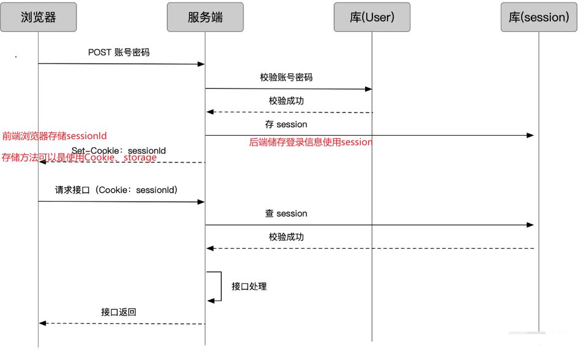

# Cookie、session和localStorage的区别

## HTTP无状态

总所周知，HTTP是无状态的。也就是说，HTTP请求方和响应方无法维状态，都是一次性的，它不知道请求的前后都发生了什么。

但某些场景下，我们需要维护状态。最典型的，一个用户登录CSDN，发布、关注、评论文章，都应该是在登录后的用户状态下实现的操作。服务器收到的每一个请求它都得知道是哪个用户的对于操作。

因此后端当第一次收到一个域发来的请求时要给该域一个临时的身份令牌作为响应返回给前端，前端将令牌储存后，后续一段时间内再次发起请求携带该令牌 ，服务器如果能找到该令牌的信息就知道该用户存在并能继续使用，否则服务器禁止该域（用户）请求相关资源返回403。

## 什么是Cookie和Session？

### 什么是Cookie

HTTP Cookie（也叫Web Cookie或浏览器Cookie）是服务器发送到用户浏览器并保存在本地的一小块数据，它会在浏览器下次请求服务器资源时被携带并发送到服务器上。通常它用于告知服务端两个请求是否来自于同一浏览器，如保持用户登录状态。Cookie使基于**无状态**的HTTP协议**记录**稳定的状态信息成为可能。

- **cookie 存储在客户端：** cookie 是服务器发送到用户浏览器并保存在本地的一小块数据，它会在浏览器下次向同一服务器再发起请求时被携带并发送到服务器上。
- **cookie 是不可跨域的：** 每个 cookie 都会绑定单一的域名，无法在别的域名下获取使用，**一级域名和二级域名之间是允许共享使用的**（**靠的是 domain）**。

| 属性         | 说明                                                         |
| ------------ | ------------------------------------------------------------ |
| name=value   | 键值对，设置 Cookie 的名称及相对应的值，都必须是**字符串类型** |
| domain       | 指定 cookie 所属域名，默认是当前域名                         |
| path         | **指定 cookie 在哪个路径（路由）下生效，默认是 '/'**。如果设置了路径则只能在该路径下的页面能获得cookie。 |
| maxAge       | cookie 失效的时间，单位秒。如果为整数，则该 cookie 在 maxAge 秒后失效。如果为负数，该 cookie 为临时 cookie ，关闭浏览器即失效，浏览器也不会以任何形式保存该 cookie 。如果为 0，表示删除该 cookie 。默认为 -1。 |
| expires      | 过期时间，在设置的某个时间点后该 cookie 就会失效。<br/>一般浏览器的 cookie 都是默认储存的，当关闭浏览器结束这个会话的时候，这个 cookie 也就会被删除。 |
| secure       | 该 cookie 是否仅被使用安全协议传输。安全协议有 HTTPS，SSL等，在网络上传输数据之前先将数据加密。默认为false。当 secure 值为 true 时，cookie 在 HTTP 中是无效，在 HTTPS 中才有效。 |
| **httpOnly** | **如果给某个 cookie 设置了 httpOnly 属性，则无法通过 JS 脚本 读取到该 cookie 的信息，但还是能通过 Application 中手动修改 cookie，所以只是在一定程度上可以防止 XSS 攻击，不是绝对的安全** |

::: tip

- cookie的内容主要包括：名字、值、过期时间、路径和域。路径和域一起构成cookie的作用域。如不设置过期时间，cookie的生命周期为浏览器的会话期间，关闭浏览器cookie就会消失。这种生命周期为浏览器会话期的cookie被称为会话cookie。会话cookie一般不存储在内存中。
- 若设置了过期时间，浏览器将把cookie保存到硬盘上，关闭后再打开浏览器这些cookie任然有效，直到超过设置的过期时间。对于保存到对于保存在内存里的cookie，不同的浏览器有不同的处理方式session机制。 
- 当程序需要为当程序需要为某个客户端的请求创建一个session时，服务器首先检查这个客户端的请求里是否已包含了一个session标识（称为session id），如果已包含则说明以前已经为此客户端创建过session，服务器就按照session id把这个session检索出来使用（检索不到，会新建一个），如果客户端请求不包含session id，则为客户端创建一个session并且生成一个与此session相关联的session id，session id的值应该是一个既不会重复，又不容易被找到规律以仿造的字符串，这个session id将被在本次响应中返回给客户端保存。保存这个session id的方式可以采用cookie，这样在交互过程中浏览器可以自动的按照规则把这个标识发送给服务器。

:::

### Cookie的使用

```js
Cookies.set("name", "value", { expires: 7 }); // 设置一个cookie，7天后失效

Cookies.get("name"); // => 'value'

Cookies.remove("name");
```

### 什么是Session

Session代表着服务器和客户端的一次会话的过程。Session对象存储特定用户会话所需要的属性及配置信息。这样，当用户在应用程序的 Web 页之间跳转时，存储在 Session 对象中的变量将不会丢失，而是在整个用户会话中一直存在下去。当客户端关闭会话，或者 Session 超时失效时会话结束。

- **session 是另一种记录服务器和客户端会话状态的机制**
- **session 是基于 cookie 实现的，session 存储在服务器端，sessionId 会被存储到客户端的cookie 中**



用户登录状态的持久化保存：

- 浏览器登录发送账号密码，服务端查用户库，校验用户
- 服务端把用户登录状态存为 Session，生成一个 sessionId
- 通过登录接口返回，把 sessionId set 到 cookie 上
- 此后浏览器再请求业务接口，sessionId 随 cookie 带上
- 服务端查 sessionId 校验 session
- 成功后正常做业务处理，返回结果

> 根据以上流程可知，**SessionID 是连接 Cookie 和 Session 的一道桥梁**，大部分系统也是根据此原理来验证用户登录状态。

## Cookie 和 Session 的区别

- cookie 数据存放在客户端，session 数据放在服务器端。
- cookie 本身并不安全，考虑到安全应当使用 session。
- session 会在一定时间内保存在服务器上。如果访问量比较大，会比较消耗服务器的性能。考虑到减轻服务器性能方面的开销，应当使用 cookie 。
- 单个 cookie 保存的数据不能超过 4K，很多浏览器都限制一个域名最多保存 50 个 cookie。 将登陆信息等重要信息存放为 session、其他信息如果需要保留，可以放在 cookie 中。

### Cookie、sessionStorage和localStorage的区别

共同点：都是保存在浏览器端、且同源的 

| **分类**       | **生命周期**                                                 | 存储容量                                   | **存储位置**                               |
| -------------- | ------------------------------------------------------------ | ------------------------------------------ | ------------------------------------------ |
| cookie         | 默认保存在内存中，随浏览器关闭失效（如果设置过期时间，在到过期时间后失效） | 4KB                                        | 保存在客户端，每次请求时都会带上           |
| localStorage   | 理论上永久有效的，除非主动清除。                             | 4.98MB（不同浏览器情况不同，safari 2.49M） | 保存在客户端，不与服务端交互。节省网络流量 |
| sessionStorage | 仅在当前网页会话下有效，关闭页面或浏览器后会被清除。         | 4.98MB（部分浏览器没有限制）               | 同上                                       |

- 应用场景：localStorage 适合持久化缓存数据，比如页面的默认偏好配置等；sessionStorage 适合一次性临时数据保存。

### WebStorage( localStorage 和 sessionStorage ) 本身就提供了比较好用的API：

```js
localStorage.setItem("name", "value");
localStorage.getItem("name"); // => 'value'
localStorage.removeItem("name");
localStorage.clear(); // 删除所有数据

sessionStorage.setItem("name", "value");
sessionStorage.setItem("name");
sessionStorage.setItem("name");
sessionStorage.clear();
```

- localStorage 写入的时候，如果超出容量会报错，但之前保存的数据不会丢失。
- localStorage 存储容量快要满的时候，getItem 方法性能会急剧下降。
- web storage 在保存复杂数据类型时，较为依赖 `JSON.stringify`，在移动端性能问题比较明显。
