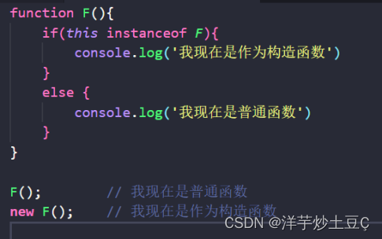
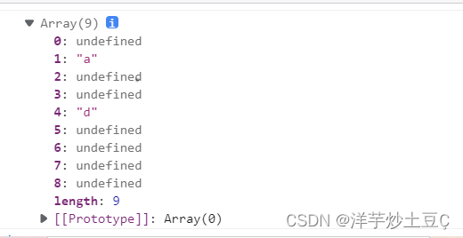
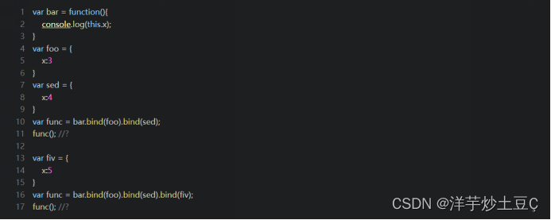
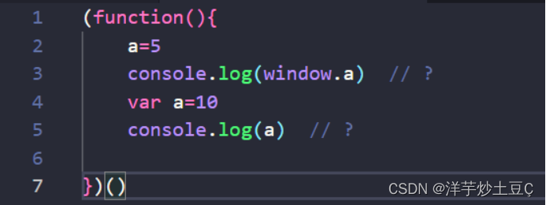
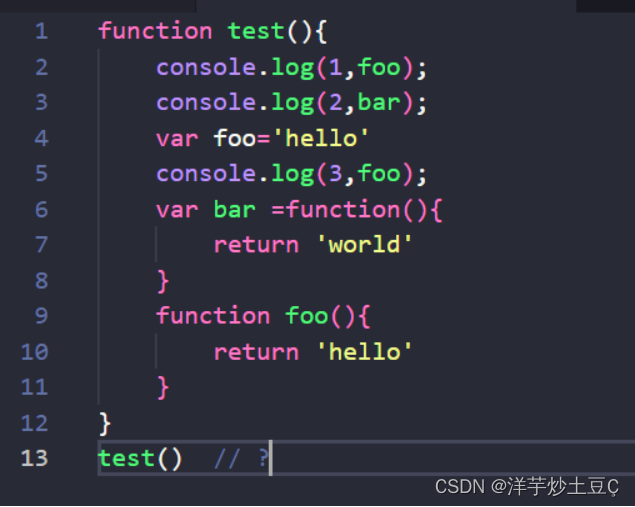

# 实验室前端小组考核题目

## 一，JS部分

### 1.深、浅拷贝的区别？你知道哪些实现深拷贝的方法?
<!-- more -->
[点击这里去往详细博客](https://blog.csdn.net/weixin_63050915/article/details/127091849)

### 2.如何判断一个函数是否作为了构造函数？



用于检测[构造函数](https://so.csdn.net/so/search?q=构造函数&spm=1001.2101.3001.7020)的 `prototype` 属性是否出现在某个实例对象的[原型链](https://so.csdn.net/so/search?q=原型链&spm=1001.2101.3001.7020)上。同时它可以判断一个对象是否是另一个对象的实例。

- 语法：

  ```
  object instanceof constructor
  ```

  - `object`：某个实例对象
  - `constructor`：某个构造函数

>  如果是则返回true，不是返回false。如代码所示，new F()返回true，即this （指向的对象，下同）是F的实例，this也已经被实例化；所以F这时候是一个构造函数。如果是F()调用，返回了false，即this不是F（）的实例化对象，即F()只是一个普通函数。

### 3.new操作符做了哪些事情？

new操作符新建了一个空对象，这个对象原型指向构造函数的prototype，执行构造函数后返回这个对象 

1. 首先创建一个新的空对象。
2. 然后将空对象的隐式原型对象（__proto__）指向构造函数的原型对象。 
   1. 这步操作将新对象的__proto__对象赋值为构造函数的prototype属性，使得能通过构造函数创建的所有对象可以共享相同的原型。
   2. 这就意味着通过一个构造函数创建的所有对象都继承自同一个相同的对象，因此它们是同一个类的对象。
3.  改变this指向，使它指向空对象。
4. 对构造函数的返回值进行判断，然后返回对应的值。 
   1. 一般是返回第一步创建的空对象。
   2. 但是当构造函数有返回值时，则需要做出判断后再对应的值，时对象类型的则返回对象，是原始类型的则返回第一步创建的空对象。 

### 4.什么是类数组，列举你知道的类数组转为数组的方法。

类数组对象，就是含有 length 属性的对象，但这个对象不是数组。 通常来说还会有 0 ～ length-1 的属性，结构表现上非常像一个数组。

```javascript
const a = {1:'a', 4: 'd', length: 9};
Array.isArray(a) // false不是数组
```


类数组转数组

> 从底层上来看，这个对象的原型链上没有 Array.prototype，所以我们不能用 Array.prototype 上的 forEach、map 等数组特有的方法。    

1.我们可以用 Array.prototype.slice 内置方法。

```javascript
Array.prototype.mySlice = function(start, end) {
  if (start == undefined) start = 0;
  if (end == undefined) end = this.length;
  const cloned = new Array(end - start);
  for (let i = 0; i < cloned.length; i++) {
    // 为了确保不存在的索引保持为 empty 值
    if (i in this) {
      cloned[i] = this[start + i];
    }
  }
  return cloned;
}
[].slice.call(obj);//[] 空数组效果同 Array.prototype.
//1.调用数组原型对象上的slice方法，我们不给 slice 方法传开始和结束位置参数，这样就会默认取整个范围。
//2.然后 call 来自 Function.prototype，可以使用一个指定的 this 值来调用一个函数，这里是 Array.prototype.slice。我们不给 slice 方法传开始和结束位置参数，这样就会默认取整个范围。
//3.因为 slice 用于拷贝返回一个新的子数组，且只需要被操作的目标有 length 属性就行了。
```

2.Array.from(),ES6 新出的方法，可以将类数组对象或者是可迭代对象转换为数组。 

 

```javascript
const a = {1:'a', 4: 'd', length: 9};
arr = Array.from(a);
console.log(arr);
//和 Array.prototype.slice.call() 有点不同，不存在的索引的值被设置了 undefined。
//如果一个对象，既是类数组对象，又是可迭代对象，Array.from() 方法会使用该对象的迭代器方法。
```

### 5. 如图，连续多次bind()的结果是什么？



bind()方法：bind() 方法为被选元素添加一个或多个事件处理程序，并规定事件发生时运行的函数。 

想要弄懂bind()就需要知道为什么需要改变this指向。[详细点击这里](https://blog.csdn.net/weixin_63050915/article/details/127096691?csdn_share_tail={"type"%3A"blog"%2C"rType"%3A"article"%2C"rId"%3A"127096691"%2C"source"%3A"weixin_63050915"})

我们要明白在js中，**多次`bind()`只有第一次绑定会生效**。

> - **后面的bind只能改变上一个bind的this指向**，最终foo执行绑定的this是由第一次bind决定
> - 因此不管foo执行多少bind，都是第一次bind绑定的对象

### 6.说说什么是防抖和节流？尝试自定义防抖函数debounce和节流函数throttle?

**防抖：**一个函数**连续多次**触发，我们只执行最后**一次**。

**节流：**一个函数**连续多次**触发，我们按照一定的时间**间隔多次**执行。

eg：

1. 一个按钮被点击时，会发送网络请求。为了**防止用户无意多次点击**，或有人恶意连续发送请求，我们不希望按钮连续被点击时，每次都发送网络请求。而是过一定时间没有再点击时，我们才发送请求——即**只执行最后一次**，而这种操纵就是防抖。
2. 滚动事件中会触发网络请求，但是我们不希望在滚动时一直发送网络请求，而是**隔一定时间**发起一次——这种操作就是节流。

**防抖函数：**

```javascript
const foo = (fn, time = 500) => {
  let timer = null
  // 使用闭包（这样节流函数复用时，不会相互影响，且不污染全局变量）
  return function( ...args ) {
    // 如果在500毫秒内再次触发，即timer存在，此时清除掉这个timer，因此这里就实现了执行只最后一次
    if (timer) clearTimeout(timer)
    timer = setTimeout(() => {
            fn.apply(this, args) // 利用apply绑定this，同时展开args数组并传参
    }, time)
  } 
}
```

**节流函数：** 

```javascript
// fn是要节流的函数，wait是时间间隔，默认500毫秒
const myThrottle = (fn, time= 500) => {
  let timer;
  return function( ...args ) {
    // 如果在500毫秒内再次触发，即timer存在，此时return，等待这个timer执行完毕。
    // 这里实现了时间间隔
    if (timer) return

    // 这里表示第一次触发，或是上一个timer执行完毕。就可以重新开启一个定时器。
    timer = setTimeout(() => {
      fn.apply(this, args)
      timer = null
    }, time)
  } 
}
```

### 7.写出 ['10', '10', '10', '10', '10'].map(parseInt) 的结果

`map()`方法定义在JavaScript的`Array`中，它**返回一个新的数组**，数组中的元素为原始数组调用函数处理后的值。

> 1. `map()`不会对空数组进行检测
> 2. `map()`不会改变原始数组

 `parseInt()` 函数解析字符串并返回整数。只返回字符串中的**第一个数字**！

它指定了要转换的字符串的基准进制(通俗点讲，就是告诉它，这个将被转换的字符串是几进制的)

那么本题按照对数组中每一个元素对进行下标的进制转换 

```javascript
['10','10','10'，'10','10'].map(parseInt))等同于

['10','10','10'，'10','10'].map((item,index) => {
    return parseInt(item,index)
})
//  parseInt('10', 0)  10 
//  parseInt('10', 1)  NaN  
//  parseInt('10', 2)  2
//  parseInt('10', 3)  3
//  parseInt('10', 4)  4
```

### 8.ES6箭头函数和普通函数有哪些区别。

- 普通函数的this中总是指向调用它的那个对象。而箭头函数没有它自己的this，它的this永远指向它的定义环境，任何方法都不能改变它的this指向，如call(),bind(),apply()。（正应为他没有this，所以就不能用作构造函数，也没有原型对象）。
- 箭头函数不能用作构造函数，所以就不能使用new命令，否则会报错。
- 箭头函数没有原型对象。
- 箭头函数不能使用argumen对象，该对象在函数体内不存在。如果要用，可以用rest参数代替。
- 变量提升：由于js的内存机制，function的级别最高，而用箭头函数定义函数的时候，需要var(let、const）关键字，而var所定义的变量不能得到变量提升。故箭头函数一定要定义于调用之前。
- 箭头函数不能使用yield命令，因此箭头函数不能用作genertor函数。

### 9.如何使用js计算一个html页面中有**多少种**标签？

这道题主要考察了 ：1.如何获取所有DOM节点。2.去重

1.方法一，也是最简单的一个。

```javascript
new Set([...document.querySelectorAll('*')].map(elem=> elem.tagName)).size
```

 2.方法二，主要区别是代码展开写，在去重时利用了indexOf方法。

```javascript
function fun() {
            var oldarr = document.getElementsByTagName('*');
            var list = Array.from(oldarr, ele => ele.tagName);//这里我通过箭头函数获取每一个元素的标签名，如果不获取的话就是node节点
            var newarr = [];
            for (var i = 0; i < list.length; i++) {
                list[i] = list[i].toLowerCase();
                if (newarr.indexOf(list[i]) === -1) {
                    newarr.push(list[i]);
                }
            }
            console.log(newarr)
        }
        fun()
```


### 10，写出下面代码的输出结果：

编辑

>  答案：undefined 10

 编辑

>  答案：1 ƒ foo(){
>          return 'hello'
>        }
>        2 undefined
>        3 'hello'

变量提升规则：

- s会将变量的声明提升到js顶部执行，对于var a = 2这种语句，会拆分开，将var a这步进行提升。
- 变量提升的本质其实是js引擎在编译的时候，就将所有的变量声明了，因此在执行的时候，所有的变量都已经完成声明。
- 当有多个同名变量的时候，函数声明会覆盖其他的声明。如果有多个函数声明，则由最后一个函数声明覆盖之前的所有声明。

```javascript
        (function () {
            a = 5;
            console.log(window.a);
            var a = 10;
            console.log(a);
        })()
        console.log('*************************************')
        function text() {
            function foo() {
                return 'hello1111'
            }
            var foo;
            var bar;
            console.log(1, foo);//函数声明高于一切，所有函数级别最高，此处直接打印函数
            console.log(2, bar);//变量提升，得到'world'
            foo = 'hello'
            console.log(3, foo);//这里由于被赋值，覆盖前面的函数，所有直接输出'hello'
            bar = function () {
                return 'world'
            }
        }
        text()
```


### 11.map方法和forEach的不同之处？

- forEach：`forEach`方法允许你通过遍历数组的每个元素来执行函数。重要的是要注意该`forEach`方法不返回任何内容，因此，如果你尝试获取`forEach`方法的返回值，则会得到 **undefined**。相反，它允许你通过在数组的每个元素上应用回调函数来修改现有数组的值。由于它**允许你修改源数组本身，**所以我们说这是可变的的方法。

```javascript
[数组].forEach(function(value, index, array) {
  ......
});
```


- map:`map`方法与`forEach`方法非常相似——它允许你为数组的每个元素执行一个函数。但不同之处在于 `map` 方法使用该函数的返回值**创建了一个新数组**。`map`通过在源数组的每个元素上应用回调函数来创建一个新数组。由于`map`不改变源数组，我们可以说它是**不可变的方法**。

```javascript
// 回调函数接受3个参数 
// 数组的当前值作为第一个参数 
// 当前值在数组中的位置作为第二个参数 
// 原始源数组作为第三个参数 
const cb = ; 
arr.map((str, i, origin) => { 
  ......
}); 
```


## 二，vue2部分

### 1. v-show和v-if的主要区别

- v-if是动态的向DOM树内**添加或者删除**DOM元素；v-show是通过**设置DOM元素的display样式**属性控制显隐；
- v-if切换有一个局部编译/卸载的过程，切换过程中合适地销毁和重建内部的事件监听和子组件；v-show只是简单的基于css切换；
- v-if是惰性的，如果初始条件为假，则什么也不做；只有在条件第一次变为真时才开始局部编译; v-show是在任何条件下（首次条件是否为真）都被编译，然后被缓存，而且DOM元素保留，只是被display设置为不可见；
- v-if有更高的切换消耗；v-show有更高的初始渲染消耗；
- v-if适合运营条件不大可能改变；v-show适合频繁切换。

### 2.vue-router传参的方式有哪些？

在vue中实现路由传参的方式有：

> - $router.push携带参数传参；
> - params传递实现传参(父传子)；
> - query传递实现传参(父传子)；

### 3.你知道哪些vue-router的钩子函数，说说他们都是什么时候触发的？

`vue-router` 的 **钩子函数** ，其实说的就是 **导航守卫** 。 

1、全局的路由钩子函数

​    **beforeEach（全局前置钩子）**，意思是在每次每一个路由改变的时候都要执行一遍

​    它有三个参数：

​    to： route：即将要进入的目标 路由对象

​    from：route：当前导航正要离开的路由

​    next：function：一定要调用该方法来resolve这个钩子。执行效果依赖next方法

​    **afterEach（全局后置钩子）**

​    beforeEach是在页面加载之前的，而afterEach是在页面加载之后的，所以这些钩子是不会接 受next函数，也不会改变导航本身。

2、单个路由内的钩子函数

​    **beforeEnter**

​    可以直接在路由配置上直接定义beforeEnter，这些守卫与全局前置守卫的方法参数是一样的

3、组件内的路由钩子函数

​    **beforeRouteEnter**、**beforeRouteUpdate**、**beforeRouteLeave**

### 4.什么是SPA？说说SPA和MPA的优缺点

SPA（ Single-page Application ）只有一个html页面，所有跳转方式都是通过组件切换完成的。

**优点：**

> - 用户体验好，流畅。
> - 因为是单页面，所以对服务器的压力较小。
> - 可以在页面切换的时候增加一些炫酷的动画效果。
> - 代码的可复用，且由于是组件化开发，有利于后期的维护。

**缺点：**

> - 页面复杂度变大，开发难度较大。
> - 不利于SEO
> - 首次加载的时候用时较长。

MPA（Multi-page Application）就是指一个应用中有多个页面，页面跳转时是整页刷新，拥右多个html页面，常见于PC端网站。

**优点：**

> - 首屏加载较快，只需要加载本页面的HTML、CSS、JS
> - 有利于优化SEO。
> - 页面复杂度不高，开发成本较低。

**缺点：**

> - 网站的后期维护难度较大。
> - 页面之间的跳转受网络以及设备等影响，耗时较长，出现空白等待的页面，用户体验不高
> - 代码重复度大。
> - 对服务器的压力较大

###  5.简述Vue2响应式原理

 Vue的响应式原理 ：**核心是通过 ES5 的 Object.defindeProperty 进行数据劫持** ，然后利用 get 和 set 方法进行数据的获取和设置 。这时的data中声明的属性都将被添加到 get 和 set 中 ，当读取data中的数据中时自动调用 get 方法 ，当修改数据时 或者数据发生改变时自动调用 set 方法。去侦听检测数据的变化时同时会通知观察者 Wacher 观察者 Wacher 自动重新触发 render 当前组件 （子组件不会重新渲染）。生成新的虚拟 DOM 树 Vue的框架会遍历并对比新旧虚拟DOM树上面的每个节点的差别并记录下来。最后加载操作，将所有记录下来的节点，局部修改到真实的DOM树上。