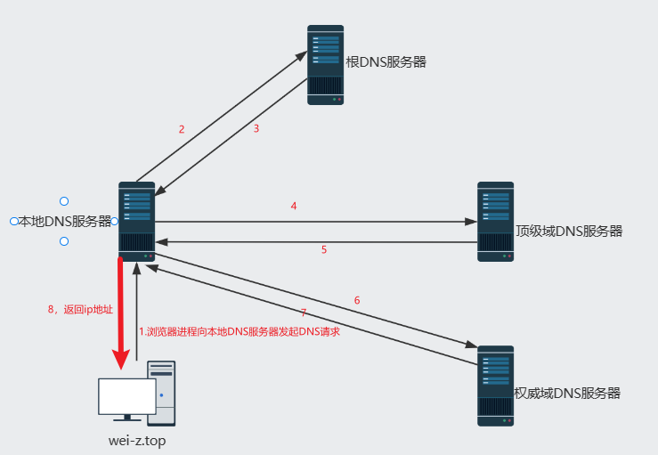
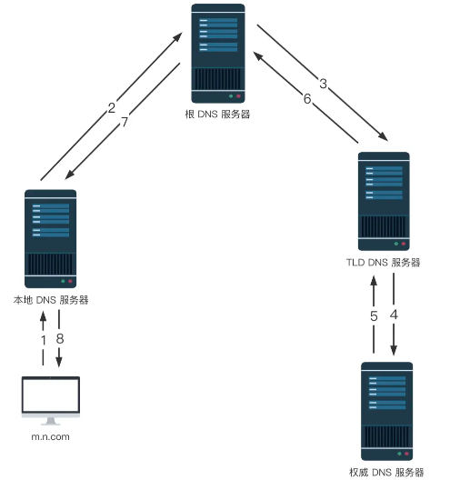
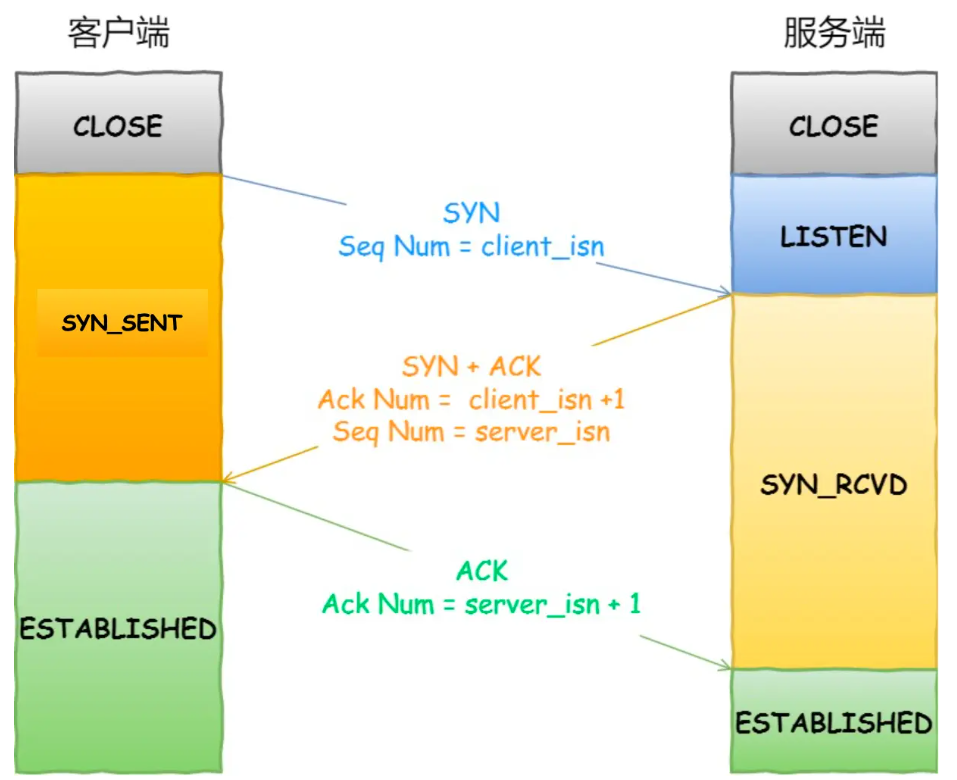
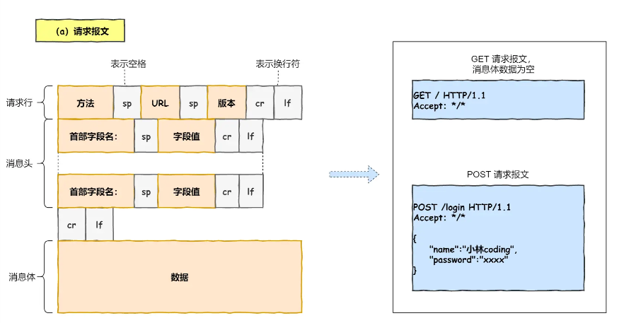
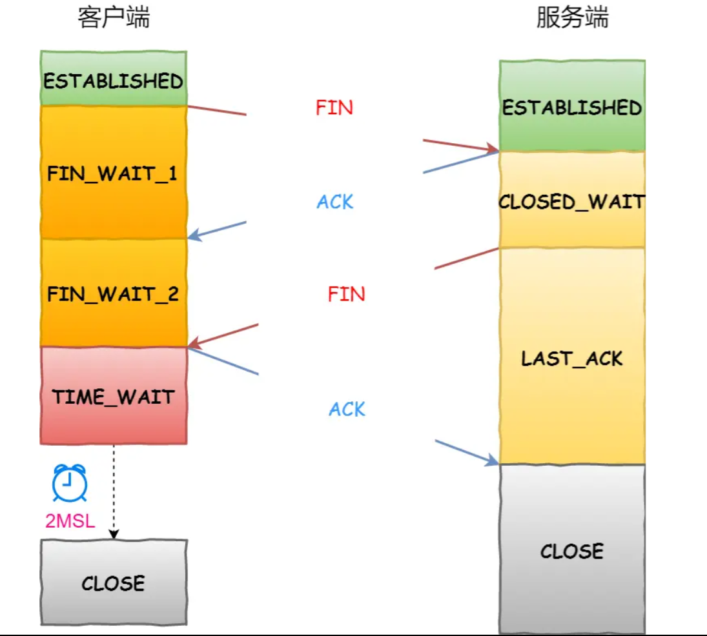

# 浏览器从输入url到渲染页面发生了什么？

## 一、解析URL

首先浏览器做的第一步工作就是要对 `URL` 进行解析，浏览器会判断这个`url`的合法性 ，以及是否有可用缓存（如果有缓存即可以不用进行下一步的DNS域名解析），如果判断是 `url` 则进行域名解析，如果不是 `url` ，则直接使用搜索引擎搜索。

<!-- more -->

## 二、DNS域名解析

输入 `url` 并点击确定访问后，第二步是进行`DNS`域名解析，如果输入的是` ip`地址，则可以省略这一步，因为`DNS`域名解析目的就是把域名解析成`ip`地址。

域名系统（`DNS`）： 域名系统是互联网的一项服务，是一个将域名和`ip`地址相互映射的分布式数据库。

### 域名的层级关系

DNS 中的域名都是用**句点**来分隔的，比如 `www.server.com`，这里的句点代表了不同层次之间的**界限**。在域名中，**越靠右**的位置表示其层级**越高**。

实际上域名最后还有一个点，比如 `www.server.com.`，这个最后的一个点代表根域名。

所以域名的层级关系类似一个树状结构：

- 根 DNS 服务器（.）
- 顶级域 DNS 服务器（.com）
- 权威 DNS 服务器（server.com）

###  本地DNS服务器

每个 ISP 都有一台本地 DNS 服务器，但**严格来说，本地 DNS 服务器并不属于 DNS 的层次结构**，但它对 DNS 层次结构是至关重要的。那什么是本地 DNS 服务器呢？

当主机发出 DNS 请求时，该请求被发往本地 DNS 服务器，**本地 DNS 服务器起着代理的作用**，并负责将该请求**转发**到 DNS 服务器层次结构中。

### 域名解析流程

#### 递归加迭代



1. 首先，主机 `wei-z.top` 向它的本地 DNS 服务器发送一个 DNS 查询报文，其中包含期待被转换的主机名 `wei-z.top`；（DNS查询请求）
2. 本地 DNS 服务器将该报文**转发到根 DNS 服务器**；（转发）
3. 该根 DNS 服务器注意到 `top` 前缀，便向本地 DNS 服务器**返回 `top` 对应的顶级域 DNS 服务器的 IP 地址**列表。（返回查询结果）
4. 本地 DNS 服务器则向其中一台 **顶级域服务器发送查询**报文；（DNS查询请求）
5. 该顶级域服务器注意到 `wei-z.top` 前缀，便向本地 DNS 服务器**返回`wei-z`对应的权威 DNS 服务器的 IP 地址**。（返回查询结果）
6. 本地 DNS 服务器又向其中一台**权威服务器发送查询**报文；（DNS查询请求）
7. 终于，该权威服务器返回了 `wei-z.top` 的 IP 地址；(拿到ip地址)
8. 本地 DNS 服务器将 `wei-z.top` 跟 IP 地址的映射返回给主机 ，主机就可以用该 IP 向 `a.b.com` 发送请求啦。

::: tip

主机向本地 DNS 服务器发出的查询就是**递归查询**，这个查询是主机以自己的名义向本地 DNS 服务器请求想要的 IP 映射，并且本地 DNS 服务器直接返回映射结果给到主机。

后继的三个查询是**迭代查询**，包括本地 DNS 服务器向根 DNS 服务器发送查询请求、本地 DNS 服务器向 TLD 服务器发送查询请求、本地 DNS 服务器向权威 DNS 服务器发送查询请求，**所有的请求都是由本地 DNS 服务器发出，所有的响应都是直接返回给本地 DNS 服务器**。

:::

#### 递归查询



###  DNS优化

#### DNS缓存

为了让我们更快的拿到想要的 IP，DNS 广泛使用了缓存技术。DNS 缓存的原理非常简单，在一个 DNS 查询的过程中，当某一台 DNS 服务器接收到一个 DNS 应答它就能够将映射缓存到本地，下次查询就可以直接用缓存里的内容。

当然，缓存并不是永久的，每一条映射记录都有一个对应的生存时间，一旦过了生存时间，这条记录就应该从缓存移出。

**有了缓存，大多数 DNS 查询都绕过了根 DNS 服务器**，需要向根 DNS 服务器发起查询的请求很少。

#### DNS负载均衡（DNS重定向）

DNS负载均衡技术的实现原理是在DNS服务器中为同一个主机名配置多个IP地址，在应答DNS查询时， DNS服务器对每个查询将以DNS文件中主机记录的IP地址按顺序返回不同的解析结果，将客户端的访问 引导到不同的机器上去，使得不同的客户端访问不同的服务器，从而达到负载均衡的目的。

#### DNS Prefetch

`DNS Prefetch` 是一种 DNS 预解析技术。当你浏览网页时，浏览器会在加载网页时对网页中的域名进行解析缓存，这样在你单击当前网页中的连接时就无需进行 DNS 的解析，减少用户等待时间，提高用户体验。

## 三、建立TCP连接

TCP 传输数据之前，要先三次握手建立连接




所以三次握手目的是**保证双方都有发送和接收的能力**。

## 四、发送HTTP请求

### 检查浏览器是否有缓存

1. 通过`Cache-Control`和`Expires`来检查是否命中强缓存，命中则直接取本地磁盘的html（状态码为200 from disk(or memory) cache，内存or磁盘）；
2. 如果没有命中强缓存，则会向服务器发起请求（先进行下一步的TCP连接），服务器通过`Etag`和`Last-Modify`来与服务器确认返回的响应是否被更改（协商缓存），若无更改则返回状态码（304 Not Modified）,浏览器取本地缓存；
3. 若强缓存和协商缓存都没有命中则返回请求结果。

### 封装HTTP请求消息



接着就是将http消息交给传输层进行TCP报文的封装，为报文加上TCP头部再交给网络层进行IP定位，最后由数据链路层给IP头部再加上MAC头部并封装成数据帧发送到网络上。

网络接口层的传输单位是帧（frame），IP 层的传输单位是包（packet），TCP 层的传输单位是段（segment），HTTP 的传输单位则是消息或报文（message）。但这些名词并没有什么本质的区分，可以统称为数据包。

## 五、TCP四次挥手断开连接

当数据传送完毕，需要断开 tcp 连接，此时发起 tcp 四次挥手。



## 六、页面渲染

最后一步就是页面渲染了，这是一个很复杂的过程

```json
1. 解析HTML，构建DOM树
2. 解析CSS，生成CSS规则树
3. 合并DOM树和CSS规则，生成render树
4. 布局render树（Layout/reflow），负责各元素尺寸、位置的计算(回流)
5. 绘制render树（paint），绘制页面像素信息（重绘）
```

