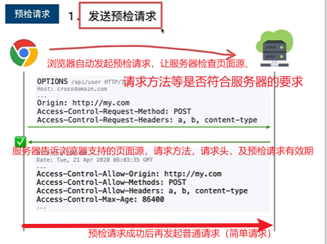

# 跨域问题

跨域问题顾名思义是当**浏览器**对不同于当前域的一个域下的资源进行访问和操作而**产生**的一系列**问题**。这些限制问题的产生是因为浏览器出于安全考虑对同源请求放行，对异源请求限制的一种规则，这种规则就是同源策略，因此限制造成的开发问题称之为跨域（异源）问题。

## 同源策略

### 何为同源

```md
源 = 协议 + 域名 + 端口
```

<!-- more -->

只要“协议 + 域名 + 端口” 不完全相同，就算是不同源。因为这个组合为每个站点提供了唯一的标识符。

这里使用MDN官网给出的示例来简单说明什么是同源。下标均与`http://store.company.com/dir/page.html`的源进行对比分析。

| URL                                               | 结果   | 原因                                 |
| ------------------------------------------------- | ------ | ------------------------------------ |
| `http://store.company.com/dir2/other.html`        | 同源   | 只有文件路径不同                     |
| `http://store.company.com/dir/inner/another.html` | 同源   | 只有路径不同                         |
| `https://store.company.com/secure.html`           | 不同源 | 协议不同                             |
| `http://store.company.com:81/dir/etc.html`        | 不同源 | 端口号不同（http:// 默认端口号是80） |
| `http://news.company.com/dir/other.html`          | 不同源 | 域名（主机）不同                     |

浏览器访问一个`html`页面这个页面是一个页面源，但是这个html中可能包含`` 、`<link>`、`AJAX`、`<audio>`、`<form>`等，这些都需要我们前往目标源请求资源，一旦目标源域页面源不是处于同源下即协议、域名、端口三者有一个不同就是跨域。

对于出现跨域的这些请求浏览器对他们的限制也是不同的，对标签发出的跨域请求**轻微限制**、对AJAX发出的跨域请求**严厉限制**。

这里我们简单讲解浏览器对AJAX的限制：


## 解决跨域问题  | CORS

### 定义

`CORS`全称：Cross-Origin-Resource Sharing（跨域资源共享），顾名思义请求可以通过使用`CORS`来允许跨源访问。`CORS`是`HTTP`的一部分，它允许服务端来指定哪些主机可以从这个服务端加载资源。

 ### 基本理念

CORS是一套机制，用于浏览器的校验跨域请求（它主要靠服务器解决）

它的基本理念是：

1. 只要服务器明确标识允许，则校验通过
2. 服务器明确表示拒绝或者没有表示，则校验不通过

### CORS把请求分为两类

#### 简单请求

- 请求方法：`GET`、`HEAD`、`POST`

- 请求头部字段满足`CORS`安全规范（只要不人为修改请求的头部就是简单请求）

- 请求头的`Content-Type`为

  - `text/plain`
  - `multipart/form-data`
  - `application/x-www-form-urlencoded`

  简单请求处理利用CORS处理跨域的方式就是给响应体头部的`Access-Control-Allow-Origin`：（填写允许访问的页面源地址或者*允许所有）;


#### 预检请求

预检请求（`preflight` ），通常`preflight`预检请求，指的就是`OPTIONS`请求。

它会在浏览器认为`即将要执行的请求可能会对服务器造成不可预知的影响时`，由浏览器自动发出。通过预检请求，浏览器能够知道当前的服务器是否允许执行即将要进行的请求，只有获得了允许，浏览器才会真正执行接下来的请求。 

通常`preflight`请求不需要用户自己去管理和干预，它的发出的响应都是由浏览器和服务器自动管理的。

**预检请求头部**

```json
Access-Control-Request-Headers: x-requested-with
Access-Control-Request-Method: POST
Origin: http://test.preflight.qq.com
```

这三个字段，依次代表访问来源、真实请求的方法和真实请求的请求头。

**响应体头部**

```json
Access-Control-Allow-Headers: Content-Type, Content-Length, Authorization, Accept, X-Requested-With
Access-Control-Allow-Origin: http://test.preflight.qq.com
Access-Control-Allow-Methods: POST, GET, OPTIONS, DELETE
Access-Control-Max-Age: 86400 //这个表示在86400ms这段时间内Access-Control-Allow-Origin的页面源都可以向服务器请求资源。预检请求的有效期
```

响应里我们需要关心的是`Access-Control-Allow-Origin` `Access-Control-Allow-Headers` `Access-Control-Allow-Methods` 这三个字段，依次代表当前请求支持的访问域、支持的自定义请求头、支持的请求方法，如果即将执行的请求的任意一项不在支持范围内，浏览器就会自动放弃执行真实请求。同时抛出`CORS`错误。

注意如果按照`CORS`规则要求如果不符合简单请求的规范就会发起预检请求。

总结来说就是，跨域不一定会触发`preflight`预检请求，发生`preflight`预检请求一定跨域了。



## 解决跨域问题 | JSONP

JSONP是解决跨域问题的古老方案。同源策略中，对标签的跨域请求限制较小。JSONP利用了这一点。

### 浏览器html页面源通过`<script src="跨域地址">`发起请求

```js
function callback(resp) {
	console.log(resp);
}
function request(url) {
    //创建一个script标签
	const script = document.creatElement('script');
    //设置script标签的src属性
    script.src = url;
    // script标签的onload事件都是在外部js文件被加载完成并执行完成后才被触发的。（也就是请求url获得的js脚本被执行完毕）
    script.onload = function() {
        //卸载标签
		script.remove();
    }
    // 添加元素到dom树
    document.body.appendChild(script);
}
document.quertSelector('button').onclick(){
	request('http://my.com/api?callback')
}
```

``

这里主要通过`<script src="跨域地址？callback">`传一个前端自定义的一个callback回调函数给服务器，由服务器传入`callback`函数参数并执行，然后将执行结果返回给浏览器。

注意这里的请求已经不是AJAX了，所以浏览器没有对跨域进行严格检验。

## 解决跨域问题 | 代理

代理服务器的使用主要是利用跨域问题在浏览器上发生这一特点，通过代理服务器代理发送请求给目标服务器。

再由代理服务器将得到的数据返回给浏览器，这样做的好处是代理服务器是我们可以操控的，比如我们可以在代理服务器上利用CORS或者JSONP解决跨域，而目标服务器我们无法操作。


