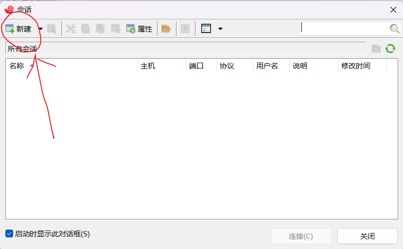
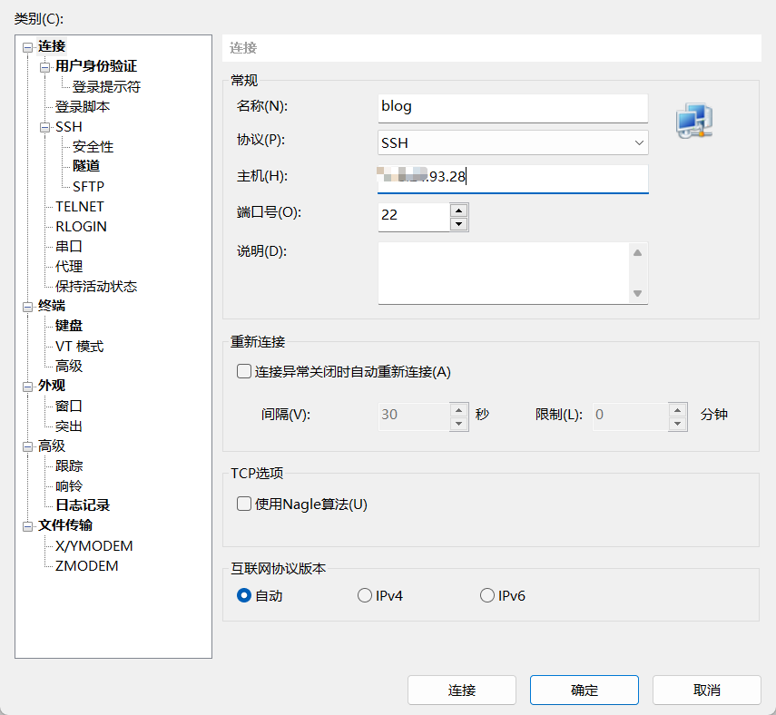
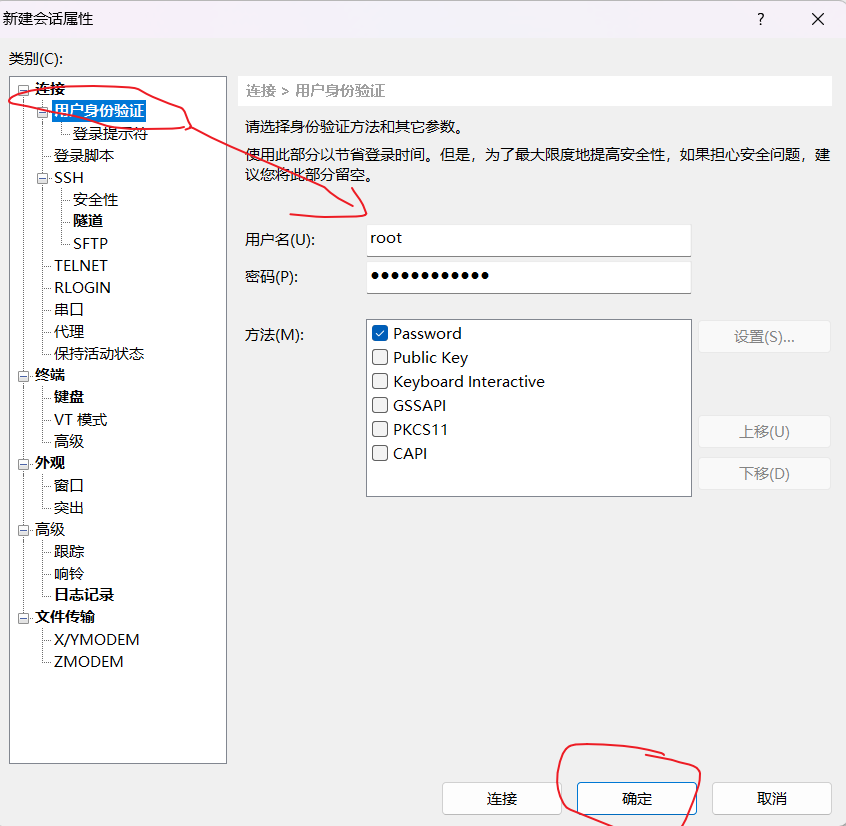
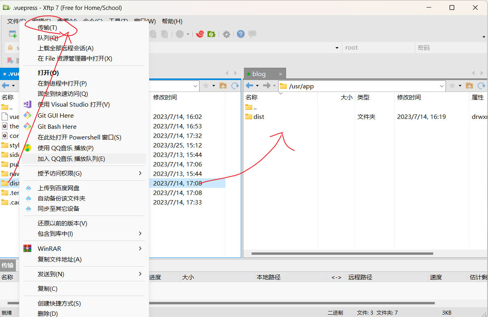

# 项目部署上线
<!-- more -->
## 买一个服务器

1.选择一个优惠的平台购买弹性云服务器ESC

2.云服务器ESC

- 地域选择：不同地域的实例之间内网互不相通；选择靠近的地域，可降低网络时延、提高访问速度
- 套餐：选择合适的就行，简单项目买最基础的就可以
- 镜像：这里我选择CentOS 7（linux服务器适合，不会浪费太多空间）
- 管理设置：选择自定义密码并记住密码

## 利用Xshell和Xftp连接服务器

1.在Xshell中新建连接：

> - 定义连接名称
> - 输入服务器公网IP，端口号默认22，
> - 点击用户身份认证，输入用户名（默认root）和登录密码点击确认
> - 点击连接，接收并保存ssh密钥即可连接云服务器成功





2.安装nginx

```shell
yum install epel-release
yum update
yum -y install nginx
# 开启nginx服务
systemctl start nginx 
```

3.打包博客项目代码

```shell
npm run docs:build
```

4.在usr文件目录下创建一个项目的文件，如app。将dist文件利用Xftp传输到服务器上的该文件中。



5.编写nginx配置文件my.conf文件（my可变）

```shell
# 先转移到conf.d目录下
cd /etc/nginx/conf.d/
# 创建并打开my.conf配置文件
vim my.conf
```

编写配置代码

```properties
server {
	listen		80;
	#由域名放域名，没有就填locahost
	server_name	locahost; 
	location / {
		#配置项目地址
		root /usr/app/dist; 
		#配置主页位置
		index index.html; 
	}
}
```

6.使配置生效

```shell
nginx -s reload
```

至此，项目上线，可通过正常ip或者域名访问网站。