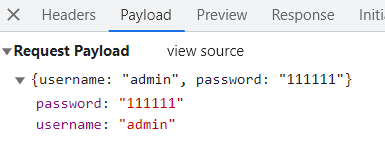
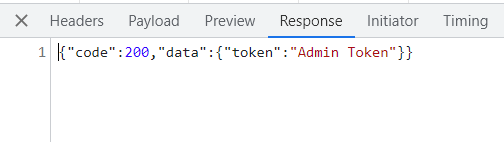
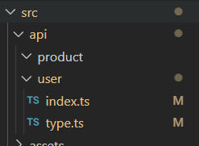

# API接口统一管理

在开发项目的时候,接口可能很多需要统一管理。在src目录下去创建api文件夹去统一管理项目的接口；这样便于后期维护和团队开发。

<!-- more -->

## axios二次封装

对于axios不熟悉的话，建议先学习这篇文章:<a href="http://wei-z.top/文章/分类/AJAX/Axios的基本使用.html">Axios的基本使用</a>

在开发项目的时候避免不了与后端进行交互,因此我们需要使用axios插件实现发送网络请求。在开发项目的时候

我们经常会把axios进行二次封装。

目的:

> 1. 使用请求拦截器，可以在请求拦截器中处理一些业务(开始进度条、请求头携带公共参数)
> 2. 使用响应拦截器，可以在响应拦截器中处理一些业务(进度条结束、简化服务器返回的数据、处理http网络错误)

在根目录下创建utils/request.ts

```ts
import axios from "axios";
import { ElMessage } from "element-plus";
//创建axios实例
let request = axios.create({
    baseURL: import.meta.env.VITE_APP_BASE_API,
    timeout: 5000
})
//请求拦截器
request.interceptors.request.use(config => {
    return config;
});
//响应拦截器
request.interceptors.response.use((response) => {
    return response.data;
}, (error) => {
    //处理网络错误
    let msg = '';
    let status = error.response.status;
    switch (status) {
        case 401:
            msg = "token过期";
            break;
        case 403:
            msg = '无权访问';
            break;
        case 404:
            msg = "请求地址错误";
            break;
        case 500:
            msg = "服务器出现问题";
            break;
        default:
            msg = "无网络";

    }
    ElMessage({
        type: 'error',
        message: msg
    })
    return Promise.reject(error);
});
export default request;
```

### 封装后的使用方法

```vue
<script setup lang="ts">
import request from '@/utils/request'//引入封装的axios方法
import { onMounted } from 'vue';

// 当组件挂载完毕测试发一个请求，通过传递相关配置（config）来创建请求
onMounted(() => {
  request({
    url: 'user/login',
    method: 'POST',
    data: {
      username: 'admin',
      password: '111111'
    }
  }).then(res => {
    console.log(res)
  })
})
</script>
```

发送的网路请求：



## 统一接口管理

这里我们需要在scr目录下创建API文件夹用于管理接口，在API文件中创建不同分类的文件夹如有关用户个人信息的文件夹中可以包含用户的登录，注册，个人信息管理等接口请求。

下面我们以用户相关接口为例对它们进行统一接口管理。



`type.ts`：对请求的参数和返回的结构进行类型的定义

```ts
// 登录接口需要携带的参数ts类型
export interface loginForm {
    username: string;
    password: string;
}
interface dataType{
    token: string;
}
export interface loginResponseData { 
    code: number,
    data: dataType
}
interface userInfo{
    userId: number,
    avatar: string,
    username: string,
    password: string,
    desc: string,
    roles: string[],
    buttons: string[],
    routes: string[],
    token: string
}
// 定义服务器返回会的用户信息相关的数据类型
interface user {
    checkUser: userInfo
}
export interface userResponseData {
    code: number,
    data: user
}
```

`index.ts`：对与个人信息有关的接口进行统一的管理暴露。

```ts
// 统一管理用户相关的接口
import request from '@/utils/request';
import type { loginForm,loginResponseData,userResponseData } from './type';
// 统一管理接口
enum API{
    LOGIN_URL = '/user/login',
    USERINFO_URL = '/user/info',
}
// 对外暴露请求函数
// 登录接口
export const reqLogin = (data: loginForm) => request.post<any,loginResponseData>(API.LOGIN_URL, data)
// 获取用户信息接口
export const reqUserInfo = (data: any) => request.get<any,userResponseData>(API.USERINFO_URL, data)
```

## 在任意组件中使用该接口

```vue
<script setup lang="ts">
import {reqLogin} from '@/api/user/index'//引用暴露的reqLogin函数，
import { onMounted } from 'vue';
// 当组件挂载完毕测试发一个请求,reqLog是统一封装管理的api暴露的接口，我们这里自需要按照接口定义的指定类型参数即可发起请求并返回响应值
onMounted(() => {
  // reqLogin(data:loginForm)函数只需要传入一个loginForm类型对象的参数即可发起请求
  reqLogin({
    username: 'admin',
    password: '123456'
  }).then(res => {
    console.log(res)
  })
})
</script>
```


