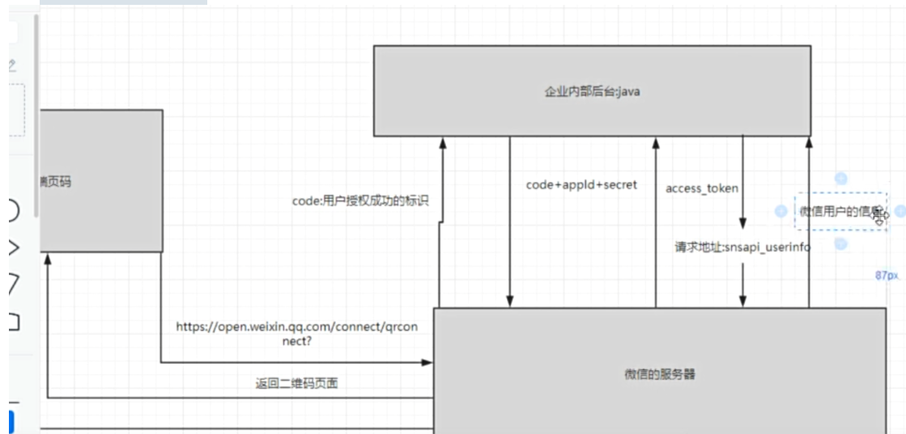
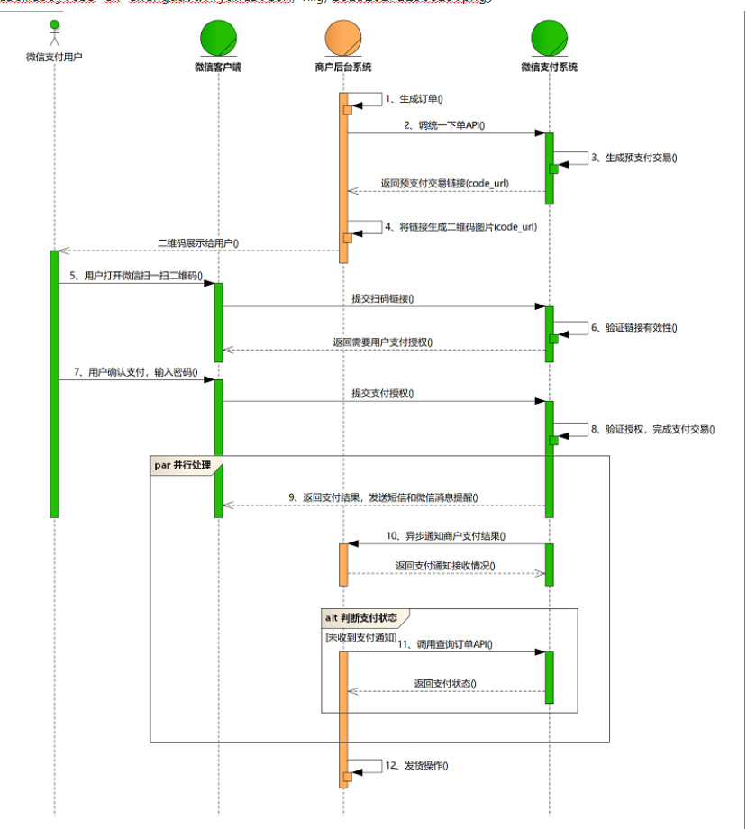

## 微信扫码登录

一开始本来是没有想搞微信扫码登录功能的，这是我大二时候刚学完vue写的第一个项目，一开始设计登录功能，也只是简单地根据跟后端同学要的接口文档，设置了token去解决的，但是有次因为疫情原因，我们无法线下进行联调了，就需要他把后端部署到swagger上，之后我就通过swagger文档进行联调，但有次我正常去登录，结果发现无法登录成功了，admin，111111,测试账号无法登录成功，结果测试swagger也不行了，就问后端同学怎么回事，后端同学一看数据库里就全部都是<scrip=t>标签包裹的一连串的代码，我当时一听一下子就很慌，就第一次遇到这个问题，我以为我造成了很严重的后果呢，之后我们就开始查找这个问题的来源，从我进行登录复盘状态，究竟是因为我的操作修改了数据库的数据，还是数据库的数据被外人修改了，最后在网上查数据库那个代码格式一看，好像是被xss攻击了，开始复盘就是可能是因为密码太简单了，没有加密，token被攻击者截取了，然后通过xss修改了数据库的数据，我认为它是在我的文本框内加入了恶意脚本，我又没有对这些脚本进行转义，后端也没有转移防xss攻击，然后就出现了问题，之后就加上了。

1 引入微信提供的生成二维码的核心插件，通过实例化WxLogin对象，这个WxLogin对象中需要几个很重要的参数，一个是appid，这是微信开放平台的一个ID，有几种不同的用户类型交了300块呢，还有redirect_url地址需要填后端服务器地址，这个是用户授权成功之后，微信第三方平台向后端传递code参数
2 然后用户通过扫描这个二维码进行登录授权，授权之后用户跳回网页的时候，微信第三方平台就会把这个code返回给服务器
3 服务器通过使用这个code还有appid还有secret一个密钥向微信平台换取access_token
4 之后服务器就可以凭借这个access_token向微信服务器访问api了，比如说获取用户的信息等

## 微信扫码支付

患者选择了对应的科室对应的主治医生之后，点击确认挂号之后，会向后端发送一个请求，请求中包含我们在选择挂号中的相关信息，后端同时会生成一个订单，并把订单信息返回给前端。后端再调用微信平台的生成订单的一个API，生成对应的预支付交易，并且会返回给服务器一个code_url交易链接，当点击确认支付的时候，后端把这个code_url交易链接二维码再返回给前端，用户打开微信扫一扫对应的二维码，支付之后，微信平台完成支付交易，返回给用户和服务器，支付成功，同时修改订单的状态

1 生成订单：患者选择了对应的科室对应的主治医生之后，点击确认挂号之后，会向后端发送一个请求，请求中包含我们在选择挂号中的相关信息，后端同时会生成一个订单，并把订单信息返回给前端
2 后端通过调用微信api，微信生成一个code_url二维码返回给服务器，服务器拿到这个code_url
3 把这个code_url转化成二维码
4 把二维码返回给客户端，
5 用户扫码确认支付，输入密码
6 微信平台完成支付交易
7 返回结果给前端和后端
8 前端通过短轮询后端，是否支付是否支付，支付成功后，修改对应状态

## Git

之前项目中是使用的GitFlow工作流程吗？它有什么好处？
GitFlow可以用来管理分支。GitFlow工作流中常用的分支有下面几类
master分支：最为稳定的最完整的，随时就可以发布的代码，代码开发完之后，经过测试，没有bug，才可以合并到master
develop分支：用作平时开发的主分支，并一直存在，永远是功能最新最全的分支，包含所有要发布 到下一个 release 的代码，主要用于合并其他分支，比如feature分支，如果修改代码，新建 feature 分支修改完再合并到 develop 分支。所有的 feature、release 分支都是从 develop 分支上拉的
feature分支：主要用于开发不同的功能，一旦开发完成，经过测试，就合并develop分支
release分支；用于发布准备的专门分支。当开发进行到一定程度，或者说快到了既定的发布日，可以发布时，建立一个 release 分支并指定版本号(可以在 finish 的时候添加)。开发人员可以对 release 分支上的代码进行集中测试和修改bug。
hotfix分支；用于修复线上代码的bug

### 初始化项目 使用git flow流

初始化项目为gitflow，默认创建master分支，然后从master上拉取develop分支
从develop拉取feature分支进行编码开发
feature分支完成后 , 合并到develop
.从develop拉取release分支进行提测 , 提测过程中在release分支上修改BUG
release分支上线后 , 合并release分支到develop/master并推送
上线之后若发现线上BUG , 从master拉取hotfix进行BUG修改
hotfix通过测试上线后，合并hotfix分支到develop/master并推送

## 双token无感刷新

accessToken:用户获取数据权限
refreshToken:用来获取新的accessToken

1 用户登录向服务端发送账号密码，登录失败返回客户端重新登录。登录成功服务端生成 accessToken 和 refreshToken，返回生成的 token 给客户端。
2 在请求拦截器中，请求头中携带 accessToken 请求数据，服务端验证 accessToken 是否过期。token 有效继续请求数据，token 失效返回失效信息到客户端。
3 客户端收到服务端发送的请求信息，在二次封装的 axios 的响应拦截器中判断是否有 accessToken 失效的信息，没有返回响应的数据。有失效的信息，就携带 refreshToken 请求新的 accessToken。
4 服务端验证 refreshToken 是否有效。有效，重新生成 token， 返回新的 token 和提示信息到客户端，无效，返回无效信息给客户端。
5 客户端响应拦截器判断响应信息是否有 refreshToken 有效无效。无效，退出当前登录。有效，重新存储新的 token，继续请求上一次请求的数据。

## 图片懒加载

图片懒加载的实现原理通常是通过 JavaScript 监听页面的滚动事件，当用户滚动到特定位置时，判断图片是否进入了可视区域。如果图片进入了可区域，则动态创建 img 元素并将图片资源的地址赋值给 img 元素的 src 属性，触发浏览器加载图片。这样可以减少初始页面的加载时间和带宽占用。
方案一：获取元素的相对浏览器可是区域的位置：getBoundingClientRect()
这个方案首先需要获取两个高度：浏览器窗口高度（可视区域高度）和元素距离浏览器窗口顶部的高度
浏览器窗口高度通过 document.documentElement.clientHeight
获取元素距离可视区域顶部的高度需要通过getBoundingClientRect() API 来实现
通过这两个高度判断的方法，实现方案也就有了，通过监听并计算 当前可视区域的高度 - 元素距离可视区域顶部的高度 ，当这个高度差大于 0 时说明图片已经进入可视区域，此时可以开始加载图片。
缺点：因为 scroll 事件会在很短的时间内触发很多次，会严重影响页面性能，为了提高网页性能，因此需要一个节流函数来控制函数的多次触发，在一段时间内只执行一次回调
方案二：异步观察目标元素：Intersection Observer
Intersection Observer（交叉观察器）是一个现代的 JavaScript API，用于监测页面上元素与视口（可见区域）之间的交叉状态
IntersectionObserver 是浏览器原生提供的构造函数，接受两个参数：callback 是可见性变化时的回调函数，option 是配置对象（该参数可选）。
目标元素的可见性变化时，就会调用观察器的回调函数 callback。callback 一般会触发两次。一次是目标元素刚刚进入视口（开始可见），另一次是完全离开视口（开始不可见）。

