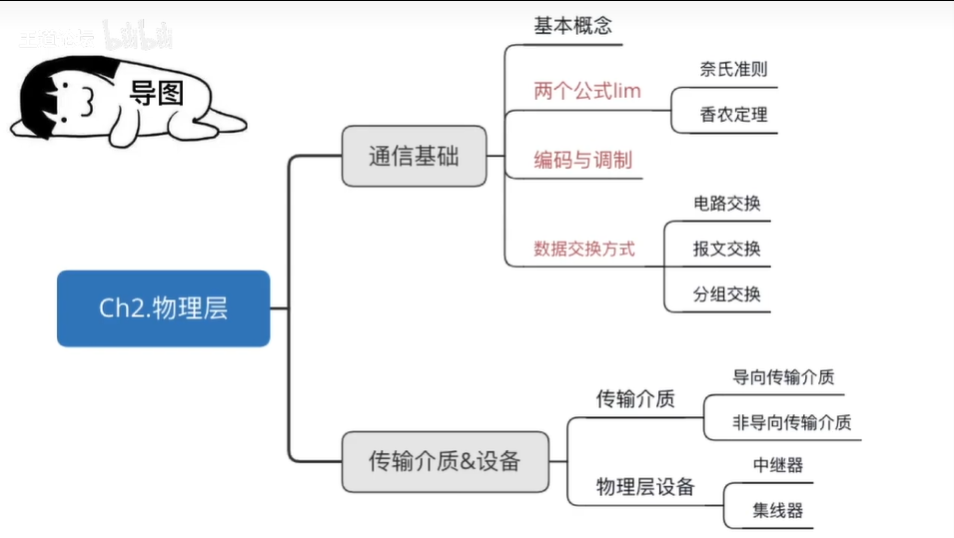

# 通信基础

## 基本概念

<!-- more -->

### 物理层接口特性

物理层解决如何在连接各种计算机的传输媒体上==传输数据比特流==，而不是指具体的传输媒体。

物理层主要任务：确定与传输媒体接口有关的一些特性。==定义标准==

1. 机械特性：定义物理特性，规定物理连接时所采用的规格、接口形状、引线数目、引脚数量和排列情况。
2. 电气特性：规定传输二进制位时，线路上信号的电压范围、抗压匹配、传输速率和距离限制等。
3. 功能特性：指明某条西安上出现的某一电平表示何种意义、接口不见的信号线用途。
4. 规程特性(过程特性)：定义各条物理线路的工作规程和时序关系。

### 三种通信方式

从通信双方信息的交互方式看，可以有三种基本方式。

1. 单工通信：只有一个方向的通信而没有反方向的交互，仅需要一条信道。
2. 半双工通信/双向交替通信：通信的双方都可以发送或接收信息，但任何一方都不能同时发送和接收，需要两条信道。
3. 全双工通信/双工通信/双向同时通信：通信双方可以同时发送和接收信息，也需要两条信道。

### 串行传输&并行传输

数据传输方式：串行传输、并行传输

串行传输：将表示一个字符的8位二进制数按照低位到高位的顺序依次发送。（速度慢、费用低、适合远距离）

并行传输：将表示一个字符的8位二进制同时通过8条信道送达。（速度快、费用高、适合近距离）

### 同步传输&异步传输

同步传输：在同步传输模式下，数据的传送是以**数据区块**位单位，因此同步传输又称为区块传输。在传送数据时，需先送出1个或多个==同步字符==，再送出整批的数据。

异步传输：异步传输将比特分成小组进行传送，小组可以是8位的1个字符或更长。发送方可以在任何时刻发送这些比特组，而接受方不知道它们会在什么时候到达。传送数据时，加一个总府起始位和一个字符终止位。

### 码元

码元是指用一个固定时长的信号波形（数字脉冲），代表不同离散数值的基本波形，是数字通信中数字信号的计量单位，这个时长内的信号称为k进制码元，而该时长称为码元宽度。当码元的离散状态有M个时（M大于2），此时码元称为M进制码元。

1码元可以携带多个比特的信息量。

### 数字通信系统数据传输速率的两种表示方法

速率也叫数据率，是指数据的传输速率，表示单位时间内传输的数据量。可以用码元传输速率和信息传输速率表示。

1. 码元传输速率：别名码元速率、波形速率、调制速率、符号速率等，它表示单位时间内数字通信系统所传输的码元个数（也可以称为脉冲个数或信号变化的次数），单位是波特（Baud）。1波特表示数字通信系统每秒传输一个码元。

   数字信号有多进制和二进制之分，但码元速率与进制数无关，只与码元长度T有关。

2. 信息传输速率：别名信息速率、比特率等，表示单位时间内数字通信系统传输的二进制码元个数（即比特数），单位是比特/秒。

   若一个码元携带n bit的信息量，则M Baud的码元传输速率所对应的信息传输速率位M×n bit/s

