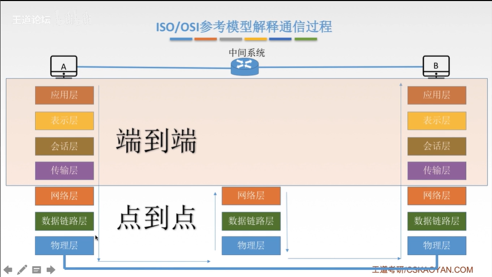
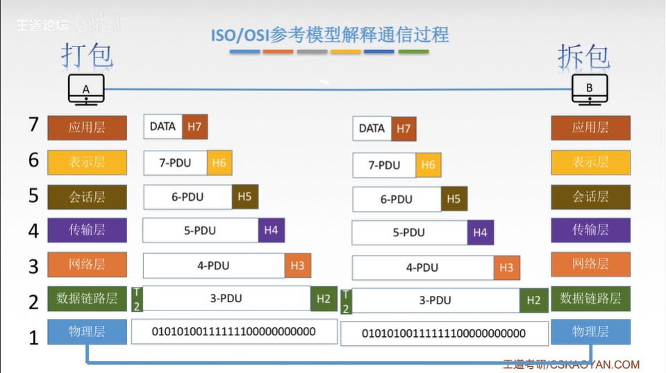
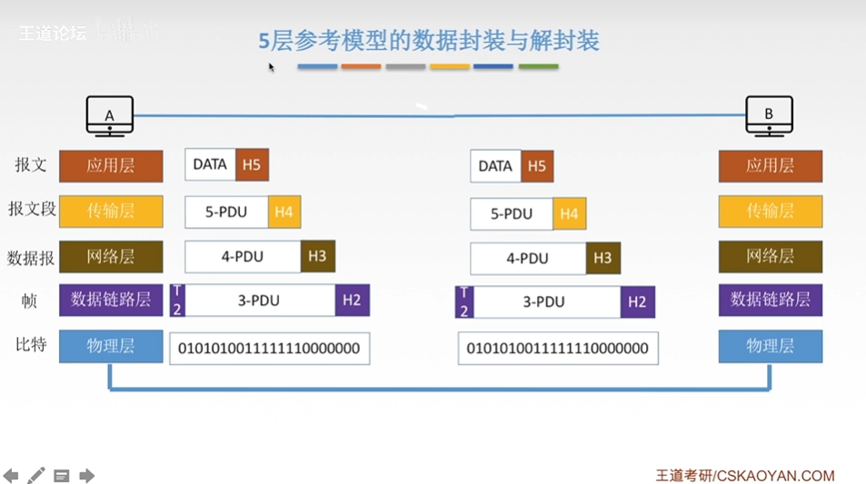
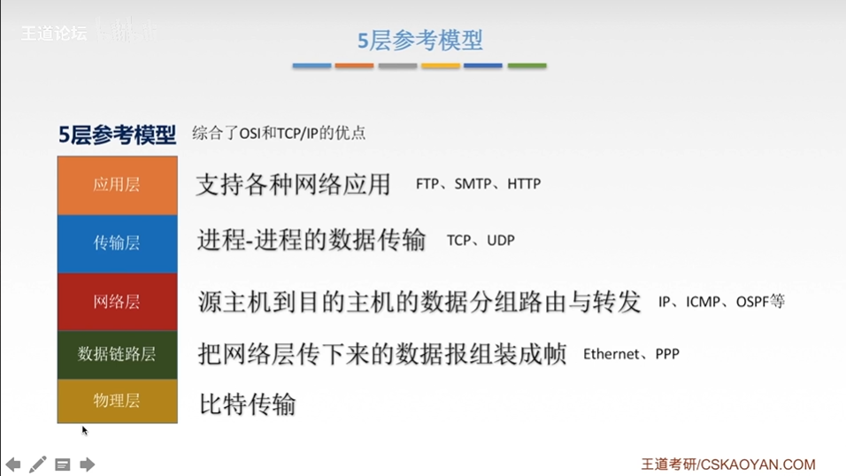

# 计算机网络体系结构

### 分层

1. **实体**：第n层的活动元素称为n层实体。同一层的实体叫对等实体。
2. **协议**：为进行网络中的对等实体数据交换而建立的规则、标准或约定称为网络协议。【水平方向看】
   1. 语法：规定传输数据的格式
   2. 语义：规定要完成的功能
   3. 同步：规定各种操作的顺序
3. **接口**（访问服务点SAP）：上层使用下层服务的入口。
4. **服务**：下层为相邻的上层提供的功能调用。【垂直】
<!-- more -->
**SDU服务数据单元**：为完成用户所要求的功能而应传送的数据。

**PCI协议控制信息**：控制协议操作的信息。

**PDU协议控制数据单元**：对等层次之传送的数据单位。

### 网络分层结构

7层OSI参考模型（法定标准）、4层TCP/IP参考模型（事实标准）

#### OSI参考模型

物理层¹、数据链路层²、网络层³、传输层⁴、会话层⁵、表示层⁶、应用层⁷

`前三层（通信子网：数据通信）、后三层（资源子网：数据处理）`

##### OSI参考模型解释通信过程

##### 应用层

定义：所有能和用户交互产生网络流量的程序

典型应用层服务：文件传输（FTP）、电子邮件（SMTP）、万维网（HTTP）

##### 表示层

定义：用于处理两个通信系统中交换信息的表示方式（语法和语义）

功能：数据格式交换、数据加密解密、数据压缩和恢复

##### 会话层

定义：向表示层实体/用户进程提供$\textcolor{red}{建立连接}$在连接上$\textcolor{red}{有序}$地传输数据。这是会话，也是建立同步（SYN）

功能：

1. 建立、管理、终止会话。
2. 使用校验点可使会话在通信失效时从==校验点/同步点==继续恢**复通信，实现数据同步**。适用于传输大文件

##### 传输层

定义：负责主机两个进程的通信，即端到端通信。传输单位时报文段或用户数据报。

主要协议：TCP、UDP

功能：（==可差==的也能==留用==？）

1. **可**靠传输、不可靠传输
2. **差**错控制
3. **流**量控制
4. 复**用**分用

##### 网络层

主要任务是把==分组==从源端传到目的端，为分组交换网上的不同主机提供通信服务。网络层传输单位是==数据报==。

主要协议：SP、IPX、ICMP、IGMP、ARP

功能：

1. 路由选择 ==*最佳路径*==
2. 流量控制
3. 差错控制
4. 拥塞控制

##### 数据链路层

主要任务是把网络层传下来的数据报==组装成帧==。数据链路层/链路层的传输单位是==帧==。

主要协议：SDLC、HDLC、PPP、STP

功能：

1. 成帧（定义帧的开始和结束）
2. 差错控制 ==帧率+错位==
3. 流量控制
4. 访问（接入）控制 ==控制对信道的访问==

##### 物理层

主要人物是在屋里媒体上实现比特流的透明传输。

物理层传输单位是比特。

透明传输：指不管传输数据是什么样的比特组合，都应当能够在链路上传达。

主要协议：	Rj45、802.3

功能：

- 定义接口特性
- 定义传输模式 ==单工、半双工、双工==
- 定义传输速率
- 比特同步
- 比特编码

#### TCP/IP参考模型

##### 5层参考模型的数据封装与解封装

