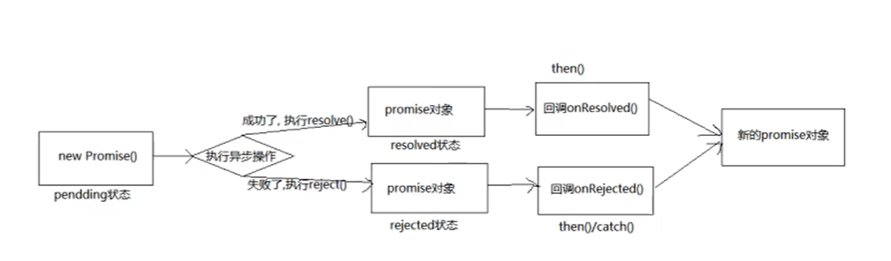

# Promise对象

## Promise概念

**`Promise`** 对象表示异步操作最终的完成（或失败）以及其结果值。

一个 **`Promise`** 是一个代理，它代表一个在创建 promise 时不一定已知的值。它允许你将处理程序与异步操作的最终成功值或失败原因关联起来。这使得异步方法可以像同步方法一样返回值：异步方法不会立即返回最终值，而是返回一个 *promise*，以便在将来的某个时间点提供该值。

一个待定的 Promise *最终状态*可以是*已兑现*并返回一个值，或者是*已拒绝*并返回一个原因（错误）。当其中任意一种情况发生时，通过 Promise 的 `then` 方法串联的处理程序将被调用。如果绑定相应处理程序时 Promise 已经兑现或拒绝，这处理程序将被立即调用，因此在异步操作完成和绑定处理程序之间不存在竞态条件。

如果一个 Promise 已经被兑现或拒绝，即不再处于待定状态，那么则称之为已*敲定（settled）*。

<!-- more -->

## 为什么要使用Promise

* 指定回调函数的方式更加灵活

  * 不使用promise的回调函数：必须在启动异步任务前指定
  * 使用promise的回调函数：启动异步任务=>返回promie对象=>给promise对象绑定回调函数（甚至可以在异步任务结束后指定/多个）

* 支持链式调用，可以解决回调地狱问题

  * 什么是回调地狱

    回调函数嵌套调用，外部回调函数异步执行的结果是嵌套的回调执行的条件

  * 回调地狱的缺点

    不便于阅读、不便于异常处理、不利于维护

    ```js
    //有多个异步任务，要求需要同时拿到所有异步任务的结果，下边就是用回调地狱
    $.get("url", (res1) => {
        conosle.log(res1)
        $.get("url+res1", (res2) => {
            conosle.log(res2)
            $.get("url+res2", (res3) => {
                conosle.log(res3)
                $.get("url+res3", (res4) => {
                    conosle.log(res4)
                })
            })
        })
    })
    ```

  * 解决方案

    promise链式调用

    ```js
    const myPromise = new Promise((resolve, reject) => {
      setTimeout(() => {
        resolve("foo");
      }, 300);
    });
    
    myPromise
      .then(handleFulfilledA, handleRejectedA)
      .then(handleFulfilledB, handleRejectedB)
      .then(handleFulfilledC, handleRejectedC);
    ```

## 异步编程

* 文件操作
```js
require('fs').readFile('./index.html',(err,data)=>{})
```
* 数据库操作
* AJAX
```js
 $.get('/server',(data)=>{})
```
*  定时器
```js
setTimeout(()=>{],2000);
```
## Promise的状态
* 一个 `Promise` 必然处于以下几种状态之一：
  - *待定（pending）*：初始状态，既没有被兑现，也没有被拒绝。
  - *已兑现（fulfilled）*：意味着操作成功完成。
  - *已拒绝（rejected）*：意味着操作失败。

## Promise 对象的值

实例对象中的另一个属性 『PromiseResult』

保存着异步任务『成功 / 失败』的结果

* resolve
* reject

## promise的基本流程



## 如何使用Promise

*  Promise构造函数：Promise(`excutor`){}
  * executor：执行器   (resolve,reject)=>{}
    * resolve函数：内部定义成功时我们调用的函数value=>{}
    * reject函数：内部定义失败时我们调用的函数reason=>{}
  
  **说明：executor会在Promise内部立即同步调用，异步操作在执行器中执行**

* `Promise.prototype.then`方法：(onResolved,onRejected)=>{}

  * onResolved函数：成功的回调函数(value)=>{}
  * onRejected函数：失败的回调函数(reason)=>{}

  **说明：指定用于得到成功value的成功回调和用于得到失败reason的失败回调返回一个新的promise对象**

 *   `Promise.prototype.catch`方法：(onRejected)=>{}
    *  onRejected函数：失败的回调函数（resson）=>{}

​		**说明：then的语法糖，相当于：then(undefined,onRejected)**

* `Promise.resolve`方法：(value)=>{}
  * value:成功的数据或promise对象

​		**说明：返回一个成功/失败的promise对象（当传入promise对象是，该方法的返回值与传入对象的结果一致）**

* `Promise.reject`方法：(reason)=>{}
  
  * reason:失败的原因
  
  **说明：返回一个失败的promise对象（不管传什么都是返回一个失败的promise对象）**
  
*  `Promise.all`方法：(promises)=>{}
  
  * promises:包含n个promise的数组

  **说明：返回一个新的promise,只有所有的promise都成功才成功，只要有一个失败了就直接失败**
  
*  `Promise.race`方法：(promises)=>{}
  
  * promises:包含n个promise的数组

  **说明：返回一个新的promise,第一个完成的promise的结果状态就是最终的结果状态**

## Promise的几个关键问题

### 如何改变promise的状态？

- resolve(value): 如果当前是pending就会变为resolved
- reject(reason小：如果当前是pending就会变为rejected
- 抛出异常：如果当前是pending就会变为rejected

### 一个promise指定多个成功/失败回调函数，都会调用吗？

- 当promise改变为对应状态时都会调用

### 改变promise状态和指定回调函数谁先谁后？

- 都有可能，正常情况下是先指定回调再改变状态(因为一般promise对象里是要处理异步任务的，所以会在指定回调函数执行了才会改变promise状态)，但也可以先改状态再指定回调，如2中所示。
- 如何先改状态再指定回调？
   1. 在执行器中直接调用resolve()/reject()
   2. 延迟更长时间才调用 
- 什么时候才能得到数据？
   1. 如果先指定的回调，那当状态发生改变时，回调函数就会调用，得到数据
   2. 如果先改变的状态，那当指定回调时，回调函数就会调用，得到数据

### Promise.then()方法的返回结果特点

- 简单表达：由then()指定的回调函数执行的结果决定
- 详细表达：
   - 如果抛出异常，新promise状态变为rejected,reason为抛出的异常
   - 如果返回的是非promise的任意值，新promise的结果变为resolved,value为返回的值
   - 如果返回的是另一个新promise,此promise的结果就会成为新promise的结果

### promise如何串连多个操作任务？

- promise的then()返回一个新的promise,可以开成then()的链式调用
- 通过then的链式调用串连多个同步/异步任务

### promise异常传透？

- 当使用promise的then链式调用时，可以在最后指定失败的回调，
- 前面任何操作出了异常，都会传到最后失败的回调中处理

### promise异常传透

  - 当使用promise的then链式调用时，可以在最后指定失败的回调
  - 前面任何操作出了异常，都会传到最后失败的回调中处理

### 中断promise链

- 当使用promise的then链式调用时，在中间中断，不再调用后面的回调函数
- 办法：在回调函数中返回一个pendding状态的promise对象