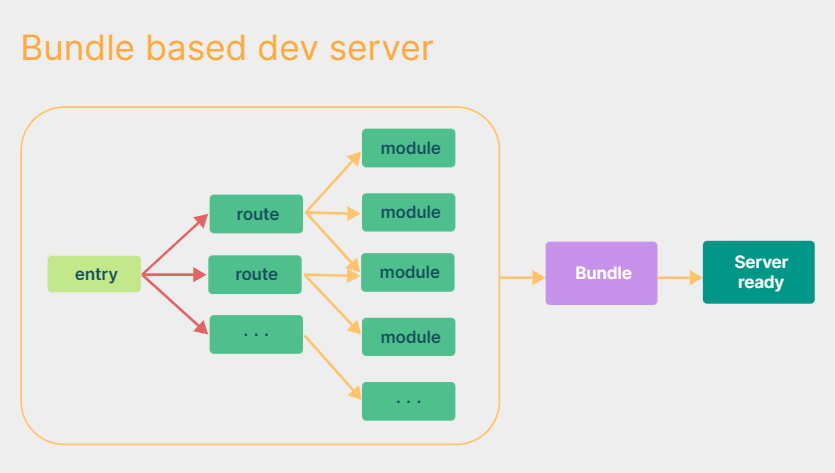
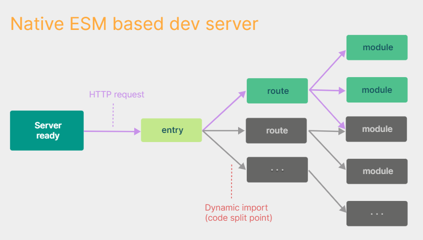

# Vite相比Webpack的优势

引用[Vite官方文档](https://cn.vitejs.dev/guide/why.html#the-problems)中的一段话:

> 当我们开始构建越来越大型的应用时，需要处理的 JavaScript 代码量也呈指数级增长。包含数千个模块的大型项目相当普遍。我们开始遇到性能瓶颈 —— 使用 JavaScript 开发的工具通常需要很长时间（甚至是几分钟！）才能启动开发服务器，即使使用 HMR(热更新)，文件修改后的效果也需要几秒钟才能在浏览器中反映出来。如此循环往复，迟钝的反馈会极大地影响开发者的开发效率和幸福感。

起因: 我们的项目越大 ----> 构建工具（webpack）所要处理的js代码就越多 【跟webpack的一个构建过程（工作流程）有关系】

造成的结果: 构建工具需要很长时间才能启动开发服务器 (启动开发服务器 ---> 把项目跑起来)

<!-- more -->

## 造成这种现象的直接原因

首先，我们要清除地了解到`Vite`相比`Webpack`有一点区别在于`Webpack`支持多种模块导入方式包括CommonJs 、 ES Modeule等等。

在启动时，它必须把所有的模块都打包构建，这样才能保证将所有的模块导入方式都转换为浏览器可以识别的模块导入方式。

由于`webpack dev server` 在启动时需要先`build`一遍，而这个过程需要消耗很多时间



而Vite 不同的是 执行`vite serve` 时，内部直接启动了web Server, 并不会先编译所有的代码文件。



但是webpack 这类工具的做法是将所有模块提前编译、打包进bundle里，换句话说，不管模块是否会被执行，都要被编译和打包到bundle里。随着项目越来越大，打包后的bundle也越来越大，打包的速度自然会越来越慢。

## Webpack可以优化吗

答案是不能，顶多我们按需引入，但是任然没有从根本上解决它导入无关模块这一个问题。所以如果一旦要改那么将会动到webpack的命脉。

因为webpack之所以强大，就是因为它强大的生态，因为它支持多种模块化:，所以你的工程将不只是跑在浏览器端。

```js
// index.js
// 这一段代码最终会到浏览器里去运行
const lodash = require("lodash"); // commonjs 规范
import Vue from "vue"; // es6 module
// webpack是允许我们同时写多种模块引入方式的
......
// webpack的一个转换结果
const lodash = webpack_require("lodash");
const Vue = webpack_require("vue");
```

webpack的编译原理：使用 AST 抽象语法分析的工具，因为构建工具是运行在服务端的，所以他可以直接分析出你写的这个js文件有哪些导入和导出操作。

```js
// 转换的核心代码（利用一个立即执行函数）
(function(modules) {
    function webpack_require() {}
    // 入口是index.js
    // 通过webpack的配置文件得来的: webpack.config.js ./src/index.js
    modules[entry](webpack_require);

}({
    "./src/index.js": (webpack_require) => {
        const lodash = webpack_require("lodash");
        const Vue = webpack_require("vue");
    }
}))
```

因为webpack支持多种模块化, 他一开始必须要统一模块化代码, 所以意味着他需要将所有的依赖全部读一遍。所以这也就表明，webpack的缺陷是难以避免的。

**综上：vite也不可能直接把webpack替代, vite是基于es modules的, 侧重点不一样, webpack更多的`关注兼容性`, 而vite关注`浏览器端的开发体验`**

